# 回响/Echoes

<p align="center">
  
</p>

一款基于 Flutter 的 Navidrome / Subsonic / OpenSubsonic 音乐客户端，面向自建音乐服务场景，重点解决多线路访问、跨设备播放、歌词封面补全、本地下载与服务器侧离线导入等实际问题。

## 使用文档

- [`gitbook/README.md`](gitbook/README.md)：快速上手文档

## 仓库组成

- **Echoes 客户端**：负责播放、浏览、搜索、歌单、收藏、歌词/封面增强、本地下载、缓存与设置
- **`gdstudio-embeded-service`**：可选的服务器侧离线导入服务，用于把远程搜索到的歌曲写入服务器音乐目录并触发 Navidrome 扫描

## 项目特点

### 多音乐库与智能线路切换

- 支持管理多个音乐库，每个音乐库可配置多条服务器地址
- 启动时按优先级探测可达地址，自动选择当前可用线路
- 运行中连接异常时自动 fallback，高优先级线路恢复后可自动回切
- 支持手动锁定线路、延迟测速和拖拽调整地址优先级

### 围绕 Navidrome 的完整听歌体验

- 支持 Token/Salt 与 API Key 登录，并自动检测 OpenSubsonic 能力
- 提供音乐流首页、专辑/歌手/歌曲/歌单浏览、收藏、搜索与播放队列
- 迷你播放器 + 全屏播放器，支持后台播放、系统通知栏控制和歌词面板
- 提供播放统计、收藏统计与缓存统计，方便观察使用情况

### 音质、缓存与播放策略可配置

- 支持原始直连和多档转码音质
- 可按 Wi-Fi / 移动数据自动切换音质
- 支持交叉淡入淡出、下一首预缓存、音频缓存上限与清理
- 提供日志导出、版本检查和缓存管理等运维向能力

### 歌词与封面增强

- 多源歌词：服务端、LRCLIB、网易云、自定义 API
- 多源封面：服务端、Fanart.tv、MusicBrainz、自定义 API
- 支持提供商优先级配置、同步歌词逐行高亮、点击歌词跳转
- 根据封面提取主色生成播放器背景氛围，并缓存歌词与资源

### 下载与离线导入双链路

- 支持歌曲、专辑、歌单的本地下载和下载管理
- 支持扫描已下载文件，统一纳入客户端管理
- 支持远程搜索与试听，并通过 Embed Service 将歌曲导入服务器音乐目录
- GitBook 文档覆盖 Navidrome、Embed Service、客户端接入与排障

### 跨平台实现，但以移动端为先

- 使用 Flutter 一套代码覆盖 Android、iOS、macOS、Windows、Linux、Web
- 当前优先打磨 Android 与 iOS 体验，桌面端与 Web 仍在持续适配

## 界面截图

<table>
  <tr>
    <td align="center">
      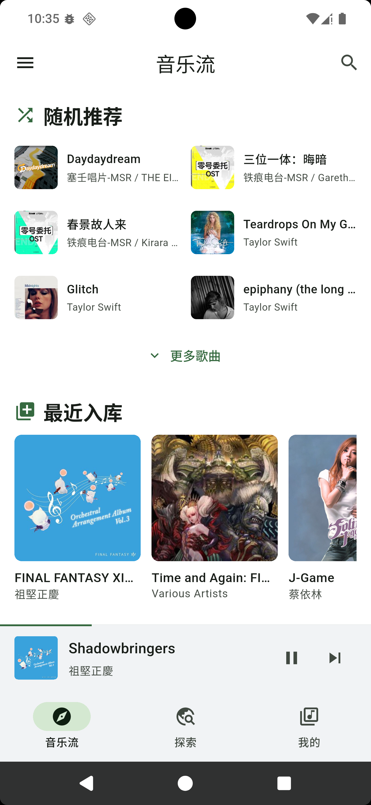<br />
      音乐流首页
    </td>
    <td align="center">
      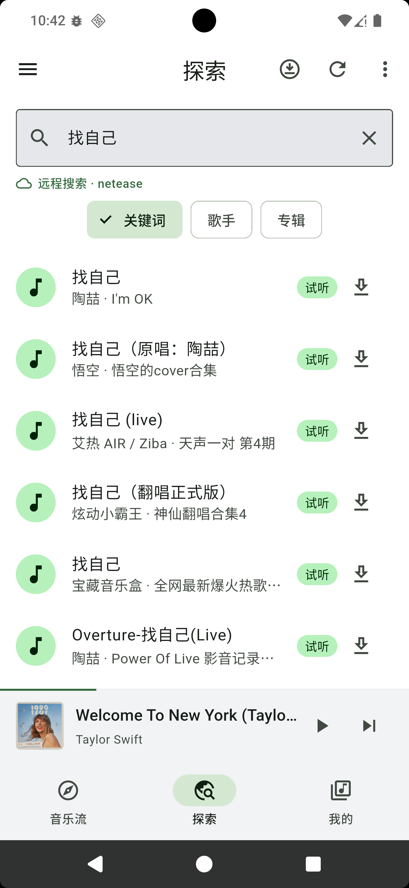<br />
      探索
    </td>
    <td align="center">
      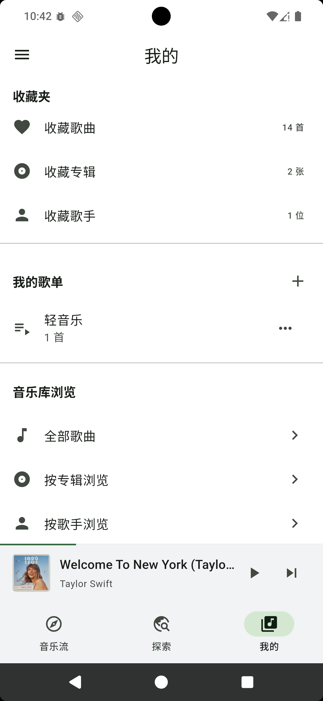<br />
      我的页面
    </td>
  </tr>
  <tr>
    <td align="center">
      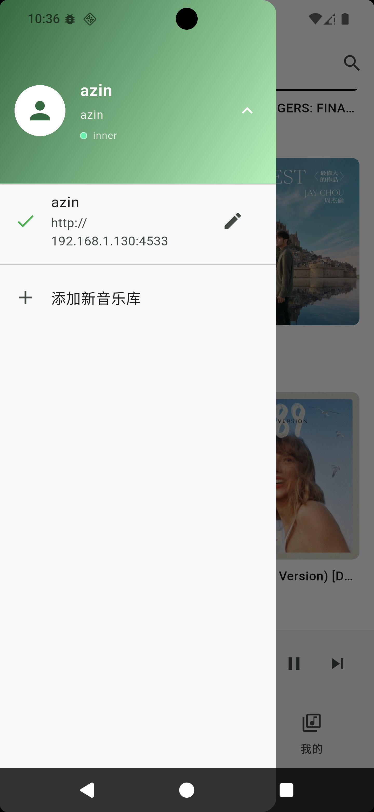<br />
      多音乐库管理
    </td>
    <td align="center">
      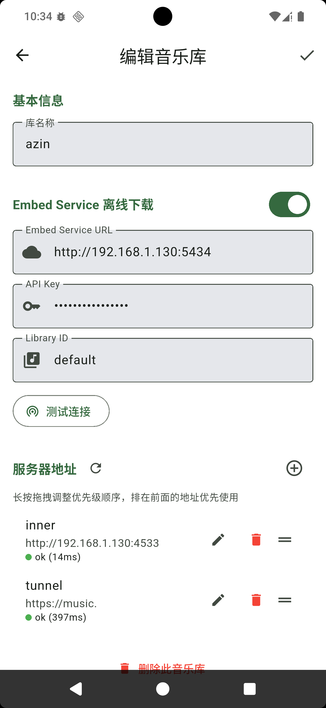<br />
      编辑音乐库与多线路
    </td>
    <td align="center">
      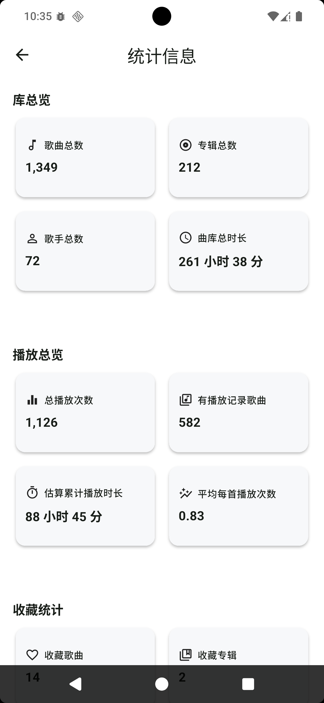<br />
      统计信息
    </td>
  </tr>
  <tr>
    <td align="center">
      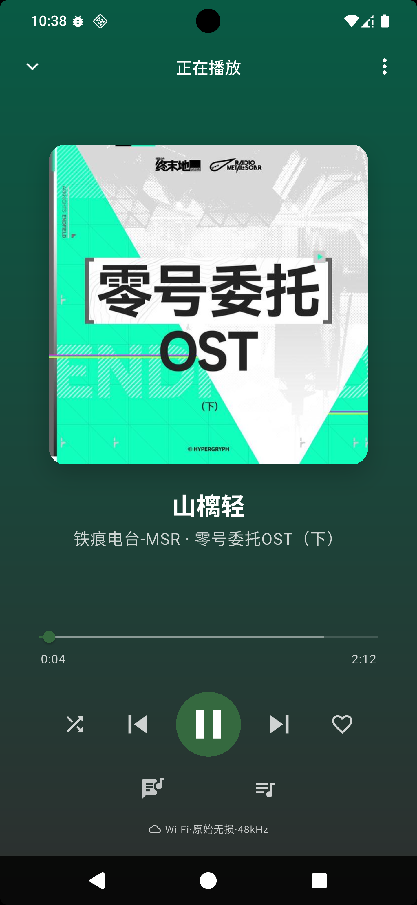<br />
      全屏播放器
    </td>
    <td align="center">
      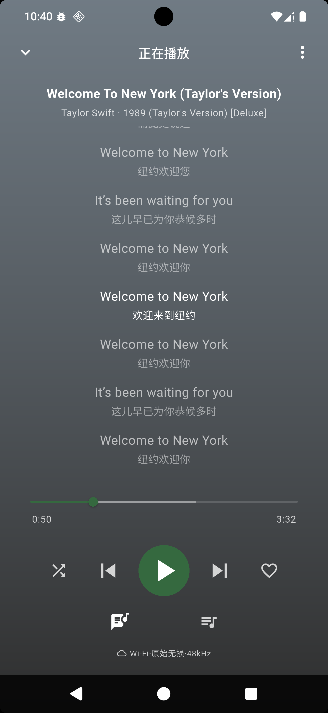<br />
      歌词
    </td>
    <td align="center">
      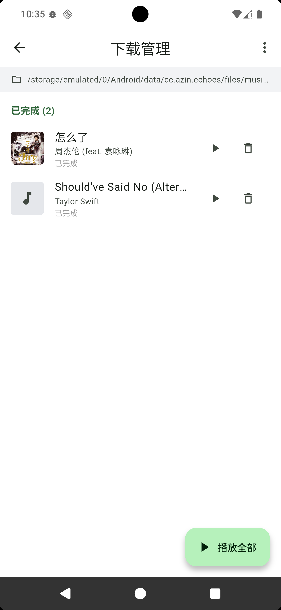<br />
      下载管理
    </td>
  </tr>
  <tr>
    <td align="center">
      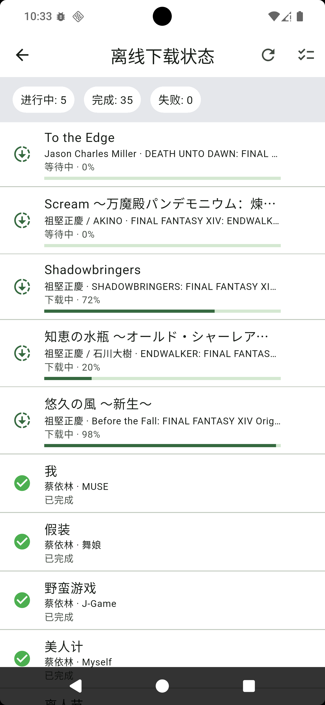<br />
      离线下载管理
    </td>
    <td align="center">
      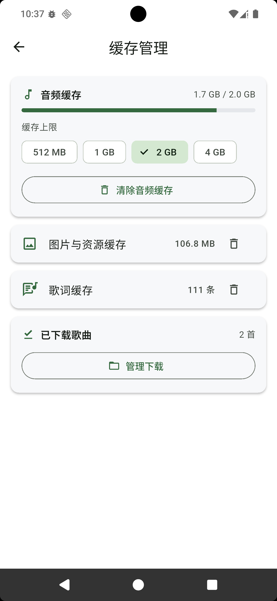<br />
      缓存管理
    </td>
    <td align="center">
      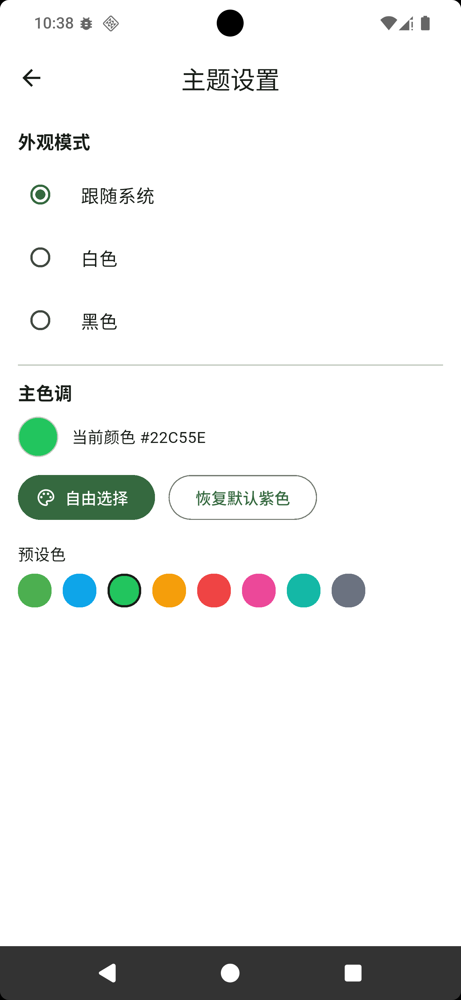<br />
      主题设置
    </td>
  </tr>
</table>

## 技术栈

| 层级 | 技术方案 |
| --- | --- |
| 框架 | Flutter |
| 状态管理 | Riverpod |
| 音频引擎 | just_audio + audio_service |
| 网络 | Dio + 自定义 Fallback 拦截器 |
| 本地数据库 | Drift (SQLite) |
| 本地配置 | SharedPreferences |
| API 协议 | Subsonic / OpenSubsonic API |
| 设计 | Material 3 + 自定义主题色 |

## 后续规划

> 本周目标完成时间：**2026-04-19（周日）**

- 添加歌曲元数据修改功能，支持在客户端内补充或修正曲名、专辑、歌手等信息
- 添加歌单获取功能，补全服务端歌单的拉取、展示与后续管理能力
- 添加 mini 播放器手势操作功能，支持更便捷的滑动、点击或拖拽交互
- 均衡器 / ReplayGain
- 持续完善桌面端与 Web 适配体验

## 快速开始

```bash
# 安装依赖
flutter pub get

# 运行代码生成（Freezed、JSON、Drift、Riverpod）
dart run build_runner build --delete-conflicting-outputs

# 运行应用
flutter run

# 构建
flutter build apk      # Android
flutter build ios      # iOS
flutter build windows  # Windows
flutter build macos    # macOS
flutter build linux    # Linux
flutter build web      # Web
```

## 项目结构

```text
lib/
├── core/                     # 常量、主题、工具类、网络基础设施
├── data/                     # 数据模型、仓库、数据源（API、数据库、本地存储）
├── features/                 # 功能模块（认证、首页、探索、音乐库、播放器、设置）
├── providers/                # Riverpod 状态管理
├── widgets/                  # 共享组件
├── main.dart                 # 入口
└── app.dart                  # 路由配置、MaterialApp

gdstudio-embeded-service/     # 服务器侧离线导入服务
gitbook/                      # 使用与部署文档
```

## 协议

客户端主要通过 Subsonic / OpenSubsonic API 与 Navidrome 等兼容服务通信；远程试听与服务器侧离线导入依赖仓库内提供的可选 Embed Service。

## 友情链接

- [gdstudio 首页](https://music.gdstudio.org/)
- [linux.do 论坛](https://linux.do/)

## 许可证

本项目基于 [MIT](LICENSE) 许可证开源。
