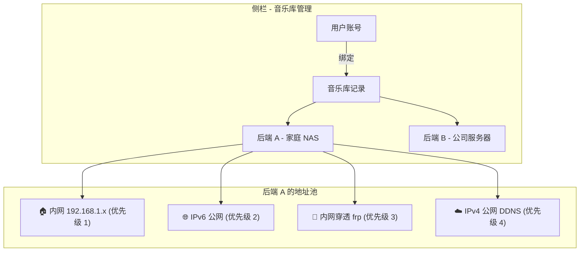
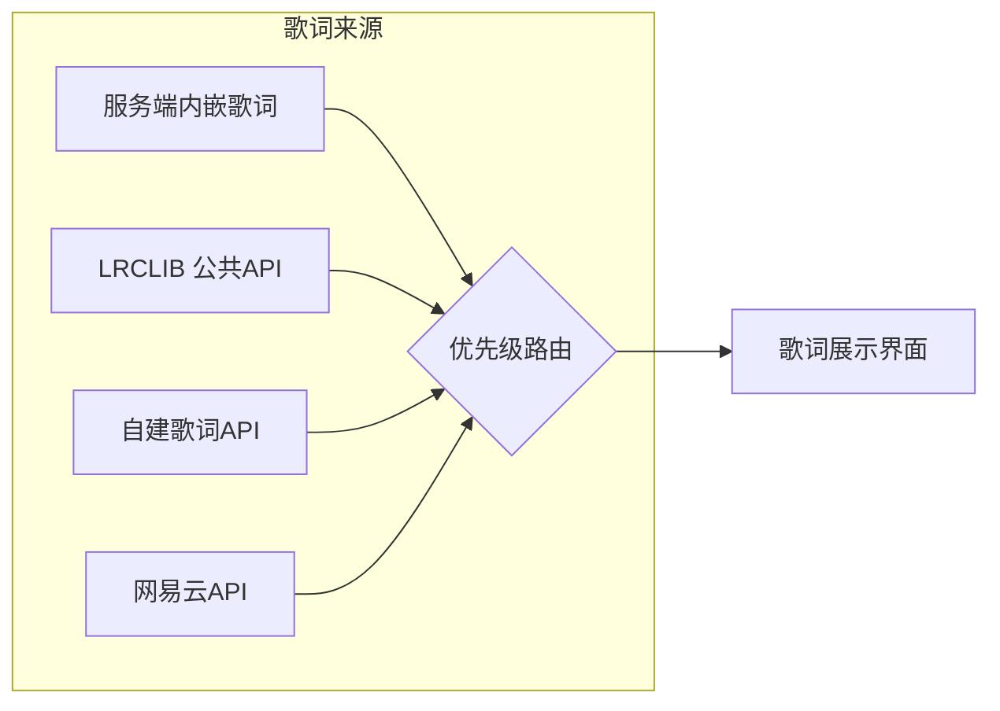
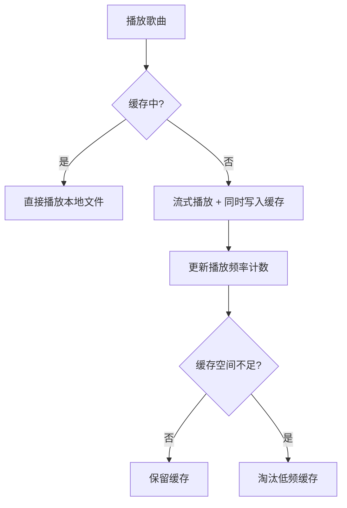
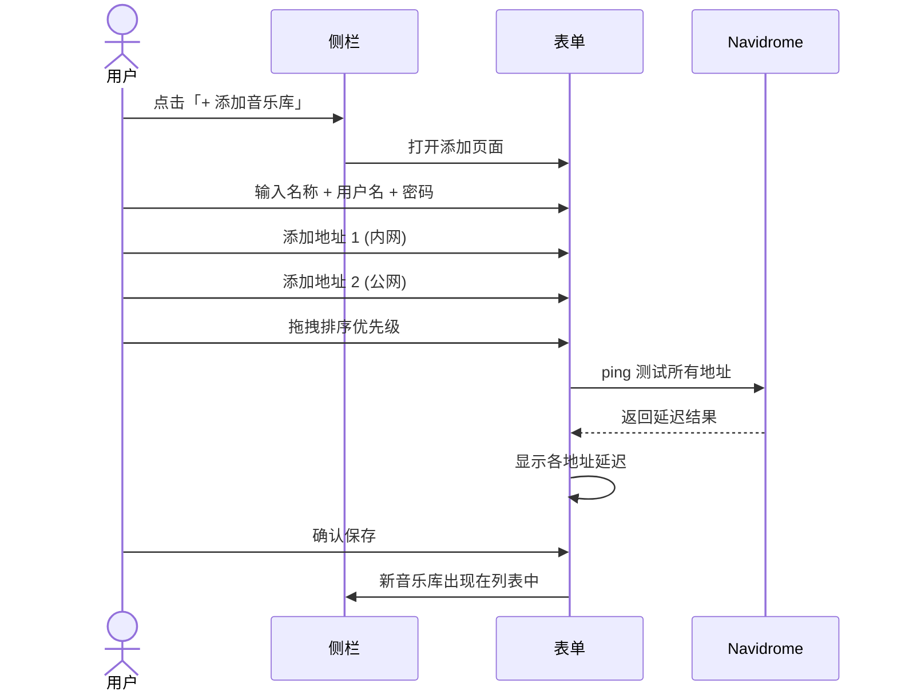

# SubSonic Flow — Navidrome 手机客户端产品规划书

> **版本**: v0.1 Draft  
> **日期**: 2026-02-10  
> **目标平台**: Android / iOS（Flutter 跨平台）

---

## 1. 产品定位

**SubSonic Flow** 是一款面向 Navidrome 自建音乐服务的高品质移动客户端，核心解决以下痛点：

| 痛点         | 现有客户端现状 | SubSonic Flow 方案                |
| ------------ | -------------- | --------------------------------- |
| 多服务器管理 | 仅支持单后端   | 支持多后端 + 多地址智能 Fallback  |
| 网络环境复杂 | 手动切换地址   | 按优先级自动探测、无感切换        |
| 音质控制     | 有限或无法控制 | 全面的转码/直连音质选项           |
| 离线与缓存   | 简单的手动下载 | 基于听歌频率的智能缓存 + 手动下载 |
| 歌词/封面    | 仅依赖服务端   | 可切换公共/私有歌词、封面提供商   |

---

## 2. 核心功能模块

### 2.1 多后端 & 多地址智能 Fallback

这是本产品的**第一亮点**，架构如下：



#### 数据模型

```
音乐库记录 (MusicLibrary)
├── id: UUID
├── name: "家庭 NAS"
├── user: { username, password/token }
├── addresses: [
│     { label: "内网",    url: "http://192.168.1.100:4533", priority: 1 },
│     { label: "IPv6",    url: "http://[2001:db8::1]:4533", priority: 2 },
│     { label: "FRP穿透", url: "https://nas.example.com",   priority: 3 },
│     { label: "公网v4",  url: "https://ddns.example.com",  priority: 4 },
│   ]
├── activeAddress: 当前生效地址
└── status: connected / fallback / offline
```

#### Fallback 策略

1. **启动时**：按用户排序（优先级）逐一探测延迟（HEAD 请求 `/rest/ping`），选择首个可达地址
2. **运行中**：后台每 30s 心跳检测当前地址
3. **切换时**：当前地址连续 2 次超时 → 自动尝试下一优先级地址 → 切换成功后 Toast 提示
4. **回落恢复**：高优先级地址恢复可达时，可选自动回切（用户可关闭）
5. **用户可手动拖动排序**地址优先级，也可手动锁定某地址

---

### 2.2 高品质音频播放

| 功能           | 说明                                                                     |
| -------------- | ------------------------------------------------------------------------ |
| 音质选项       | 原始直连（FLAC/WAV/APE）、高品质 320kbps、标准 192kbps、流量节省 128kbps |
| 按网络自动切换 | Wi-Fi 下使用原始/高品质，移动数据下使用标准/节省（可配置）               |
| 无缝播放       | Gapless playback，支持 crossfade 淡入淡出                                |
| 音频引擎       | 基于平台原生解码（Android: ExoPlayer / iOS: AVAudioEngine）              |
| 均衡器         | 内置多频段 EQ + 预设（流行、摇滚、古典等）                               |
| ReplayGain     | 支持按专辑/按曲目音量标准化                                              |

#### 转码请求流程

```
用户选择「高品质 320kbps」
   ↓
客户端请求: /rest/stream?id=xxx&maxBitRate=320&format=mp3
   ↓
Navidrome 服务端转码返回
   ↓
客户端播放 + 缓存转码后的文件
```

---

### 2.3 歌词 & 封面提供商切换



- **公共提供商**：LRCLIB、网易云音乐、QQ音乐歌词接口等（内置）
- **私有提供商**：用户可配置自建歌词 / 封面 API 地址
- **优先级**：服务端内嵌 > 用户自定义 > 公共提供商（可拖拽排序）
- **封面同理**：Navidrome 服务端 > Fanart.tv > MusicBrainz > 自定义源

---

### 2.4 下载 & 智能缓存

#### 手动下载

- 支持按曲目、专辑、歌单批量下载
- 可选择下载音质（原始 / 转码）
- 下载管理器：进度、暂停/恢复、删除
- 存储路径可配置

#### 智能缓存（边听边缓存）



**缓存策略**：

| 参数         | 默认值             | 说明                          |
| ------------ | ------------------ | ----------------------------- |
| 最大缓存空间 | 2 GB               | 用户可调整                    |
| 淘汰算法     | **LFU + LRU 混合** | 优先淘汰低播放频率 + 最久未听 |
| 缓存保护     | 播放 ≥ 5 次        | 高频歌曲不参与自动淘汰        |
| 预缓存       | 下一首             | 播放队列中预缓存下一首歌      |

---

## 3. UI 架构设计

### 3.1 整体布局

```
┌──────────────────────────────────┐
│  ☰ 侧栏触发    顶部标题栏        │
├──────────────────────────────────┤
│                                  │
│         内容区域                  │
│    (根据底栏选项切换)              │
│                                  │
│                                  │
├──────────────────────────────────┤
│  🎵 迷你播放器 (当前曲目/进度)     │
├──────────────────────────────────┤
│   🎶 音乐流   │   👤 我的        │
│   (Tab 1)     │   (Tab 2)       │
└──────────────────────────────────┘
```

---

### 3.2 Tab 1 — 音乐流 🎶


> 首页信息流，展示个性化推荐，让用户快速「续听」

#### 页面结构

```
音乐流
├── 🔍 搜索栏
├── 📌 继续收听 (最近播放的 5 首，横向滑动)
├── 🔥 经常听的歌曲 (按播放次数排序，网格/列表切换)
├── 📋 经常听的歌单 (横向卡片轮播)
├── 💿 经常听的专辑 (大封面网格)
└── 🎲 随机推荐 (服务端 getRandomSongs)
```

**设计要点**：

- 大封面卡片设计，视觉冲击力强
- 每个区块右上角「查看全部」可展开完整列表
- 下拉刷新获取最新数据

---

### 3.3 Tab 2 — 我的 👤

> 当前音乐库的个人空间

#### 页面结构

```
我的
├── 📋 我的歌单
│     ├── ❤️ 收藏夹 (starred)
│     ├── 用户创建的歌单 1
│     ├── 用户创建的歌单 2
│     └── ＋ 新建歌单
│
├── 📚 音乐库浏览
│     ├── 💿 按专辑浏览
│     │     └── 专辑列表 → 专辑详情 (曲目列表)
│     ├── 📁 按文件夹浏览
│     │     └── 文件夹树 → 文件列表
│     └── 🎤 按歌手浏览
│           └── 歌手列表 → 歌手详情 (专辑 + 热门曲目)
│
├── ⬇️ 已下载
│     └── 离线可用的曲目/专辑
│
└── ⚙️ 播放统计
       └── 最多播放 / 最近播放 / 播放时长统计
```

---

### 3.4 侧栏 — 音乐库 & 用户管理


> 侧栏是音乐库生命周期管理入口

```
侧栏
├── 🏷️ 当前音乐库名 (点击切换)
│      ├── ✅ 家庭 NAS (已连接 - 内网)
│      ├── 🔄 公司服务器 (Fallback - 公网)
│      └── ＋ 添加音乐库
│
├── ⚙️ 音乐库设置 (当前选中)
│      ├── 编辑名称
│      ├── 管理地址池 (添加/排序/删除地址)
│      ├── 用户凭据管理
│      └── 连接状态 & 延迟测试
│
├── 🎵 播放设置
│      ├── 音质选择
│      ├── 均衡器
│      └── Gapless / Crossfade
│
├── 📥 缓存管理
│      ├── 缓存空间使用情况
│      ├── 清除缓存
│      └── 缓存策略设置
│
├── 🔤 歌词/封面提供商
│      ├── 歌词源排序
│      └── 封面源排序
│
└── ℹ️ 关于
```

#### 添加音乐库流程



---

## 4. 全屏播放器


```
┌──────────────────────────────────┐
│  ← 收起        ··· 更多          │
│                                  │
│         ┌──────────────┐         │
│         │              │         │
│         │   专辑封面    │         │
│         │   (大图)     │         │
│         │              │         │
│         └──────────────┘         │
│                                  │
│    曲目名称                       │
│    歌手 - 专辑名                  │
│                                  │
│   advancement bar: ──●───── 3:24  │
│                                  │
│    🔀    ⏮️    ▶️    ⏭️    🔁     │
│                                  │
│  🔉 ─────●──────────── 🔊       │
│                                  │
│  ♡    📥    📋    🎤 歌词        │
│                                  │
│  ┌ 歌词展示区 (可上下滑动) ──────┐ │
│  │  ...                         │ │
│  │  ▶ 当前歌词行 (高亮)          │ │
│  │  ...                         │ │
│  └──────────────────────────────┘ │
│                                  │
│  当前音质: FLAC · 内网           │
└──────────────────────────────────┘
```

---

## 5. 技术选型

| 层级     | 技术方案                           | 说明                               |
| -------- | ---------------------------------- | ---------------------------------- |
| 框架     | **Flutter**                        | 跨平台，一套代码覆盖 Android / iOS |
| 状态管理 | **Riverpod**                       | 声明式、可测试、类型安全           |
| 音频引擎 | **just_audio** + **audio_service** | 后台播放、通知栏控制、Gapless      |
| 网络     | **Dio** + 自定义 Interceptor       | 地址池 Fallback 拦截器自动切换     |
| 本地存储 | **Drift (SQLite)**                 | 缓存元数据、播放统计、配置         |
| 缓存     | **自研文件缓存管理器**             | LFU+LRU 混合淘汰策略               |
| API 协议 | **Subsonic API**                   | Navidrome 完整兼容 Subsonic API    |
| 设计     | **Material 3** + 自定义主题        | 支持 Dynamic Color / 深色模式      |

### Fallback 网络层架构

```dart
// 伪代码：Dio Interceptor 实现自动 Fallback
class FallbackInterceptor extends Interceptor {
  @override
  void onError(DioException err, ErrorInterceptorHandler handler) {
    if (isConnectionError(err)) {
      // 标记当前地址不可用
      addressPool.markFailed(currentAddress);
      // 获取下一个可用地址
      final next = addressPool.getNextAvailable();
      if (next != null) {
        // 用新地址重试请求
        final retryOptions = err.requestOptions.copyWith(baseUrl: next.url);
        return handler.resolve(await dio.fetch(retryOptions));
      }
    }
    return handler.next(err);
  }
}
```

---

## 6. 开发路线图

### Phase 1 — MVP（8 周）

- [x] 项目脚手架 & 基础架构
- [ ] 音乐库管理（单后端 + 多地址 + Fallback）
- [ ] Subsonic API 接入（认证 / 歌曲 / 专辑 / 歌手 / 歌单）
- [ ] 底栏两 Tab + 侧栏基础 UI
- [ ] 音频播放器（基础播放 / 播放队列 / 后台播放）
- [ ] 迷你播放器 + 全屏播放器

### Phase 2 — 体验增强（6 周）

- [ ] 多后端支持
- [ ] 音质切换 & 按网络自动切换
- [ ] 歌词展示 + 提供商切换
- [ ] 封面提供商切换
- [ ] 下载管理器
- [ ] 边听边缓存 + 智能淘汰

### Phase 3 — 精打细磨（4 周）

- [ ] 均衡器 & ReplayGain
- [ ] Gapless / Crossfade
- [ ] 播放统计可视化
- [ ] 深色模式 & Dynamic Color
- [ ] 性能优化 & 上架准备

---

## 7. 竞品对比

| 功能                   | SubSonic Flow |  Symfonium   |  Ultrasonic  | Subtracks |
| ---------------------- | :-----------: | :----------: | :----------: | :-------: |
| 多后端                 |      ✅       |      ✅      |      ❌      |    ❌     |
| 多地址 + 自动 Fallback |      ✅       |      ❌      |      ❌      |    ❌     |
| 音质切换               |      ✅       |      ✅      |      ✅      |    ❌     |
| 智能缓存               |      ✅       |     部分     |      ❌      |    ❌     |
| 歌词/封面提供商切换    |      ✅       |     部分     |      ❌      |    ❌     |
| 离线下载               |      ✅       |      ✅      |      ✅      |    ❌     |
| 跨平台                 | ✅ (Flutter)  | ❌ (Android) | ❌ (Android) |  ✅ (RN)  |
| 开源                   |      ✅       |      ❌      |      ✅      |    ✅     |

---

## 8. 总结

**SubSonic Flow** 的核心差异化在于：

1. **多地址智能 Fallback** — 真正解决复杂网络环境下的无缝连接
2. **灵活的提供商机制** — 歌词、封面不再受限于服务端
3. **频率驱动的智能缓存** — 越常听的歌曲，离线可用性越高
4. **跨平台 + 开源** — Flutter 覆盖双端，社区共建

以上为 v0.1 初版规划，待进一步细化 UI 原型与技术 POC 后迭代更新。
