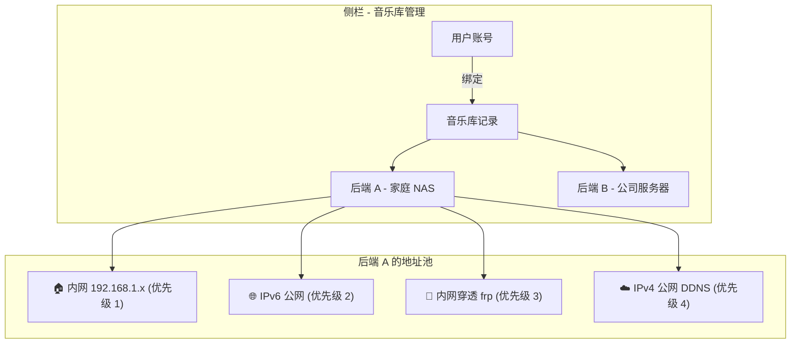
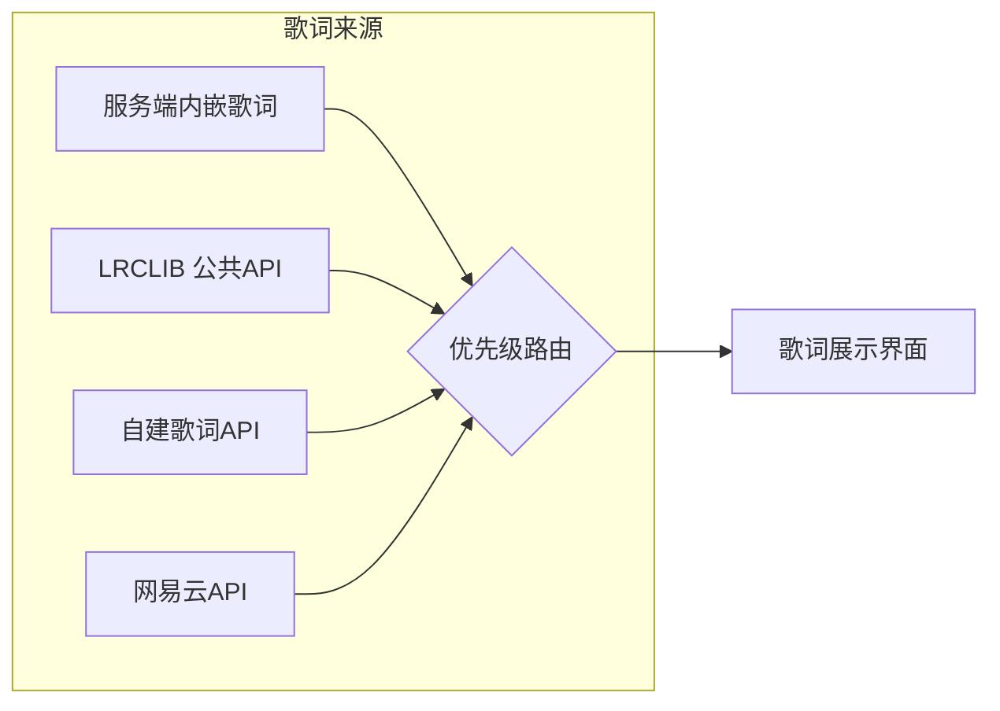
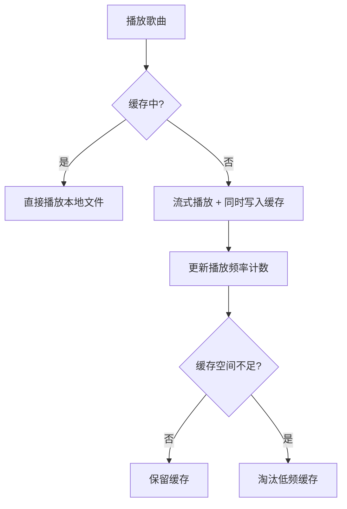
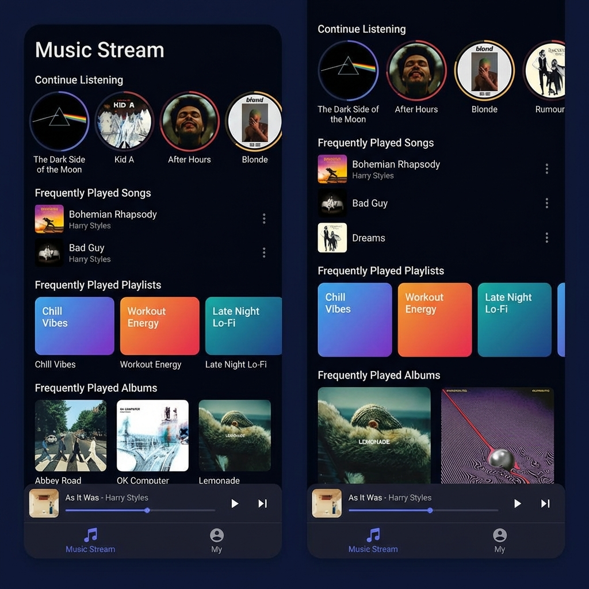
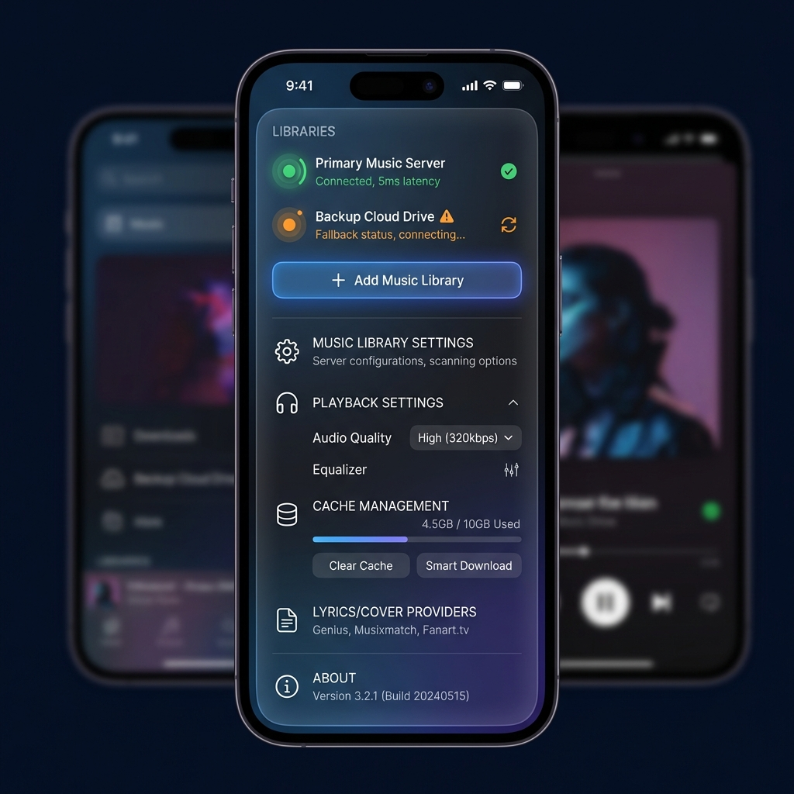
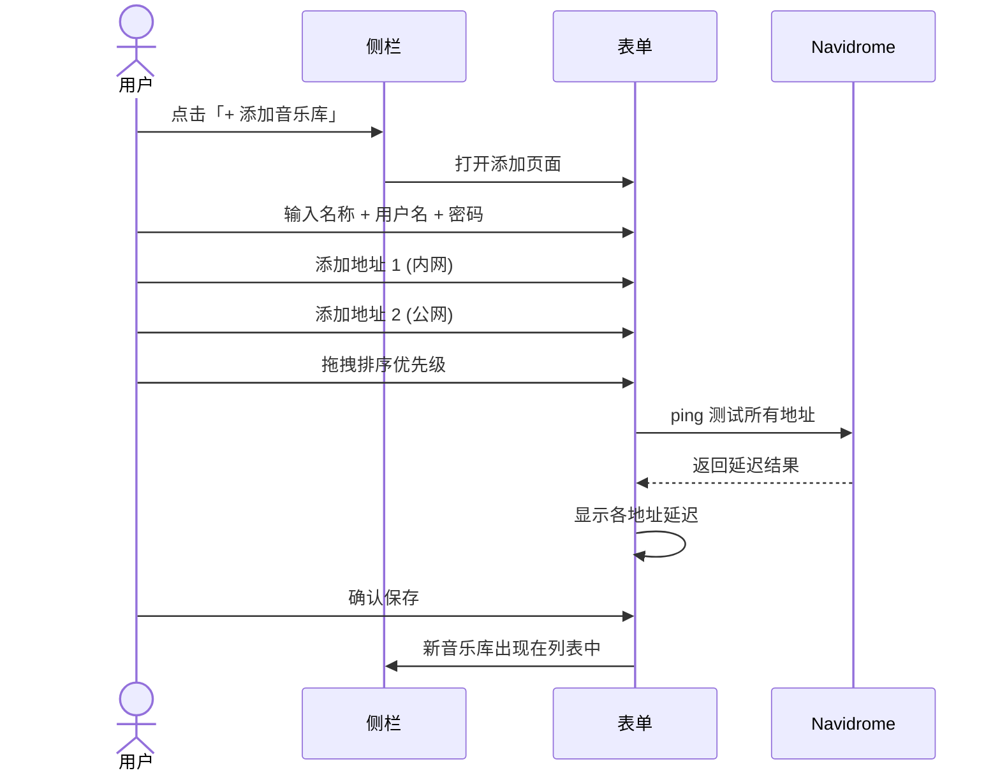
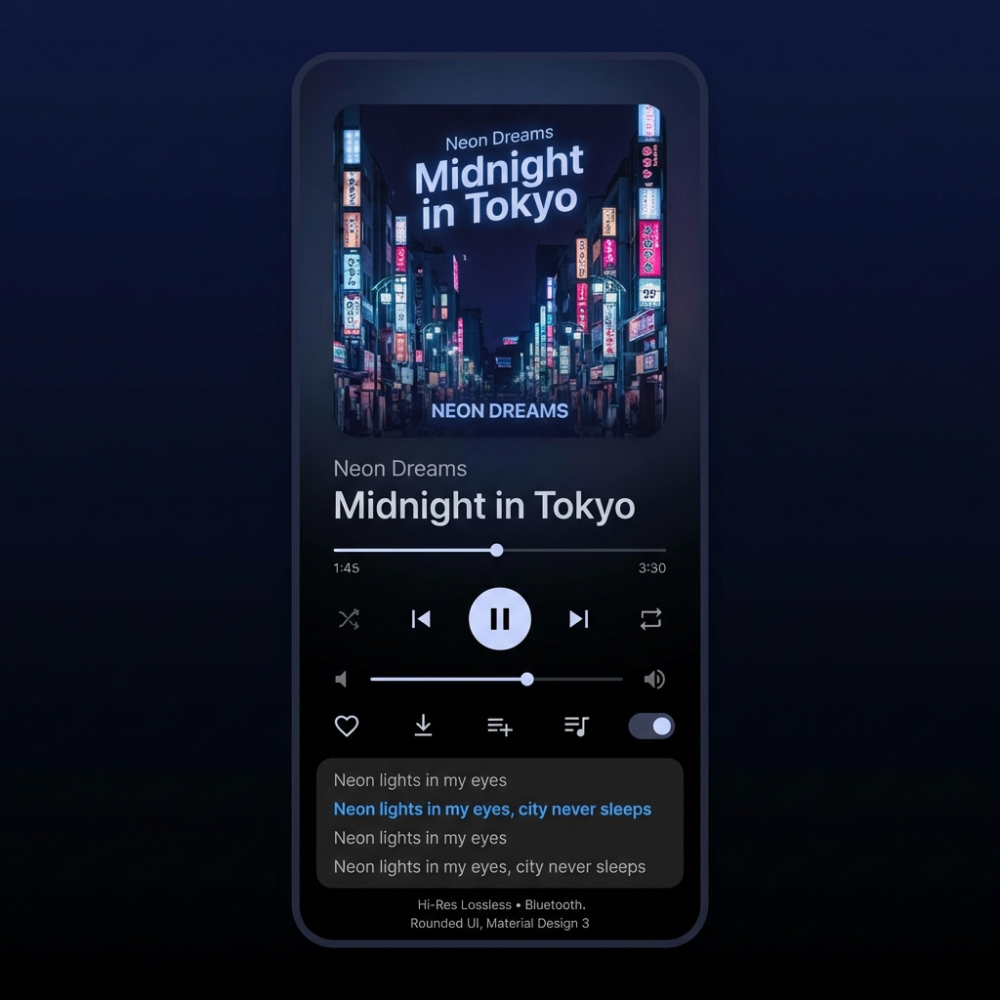
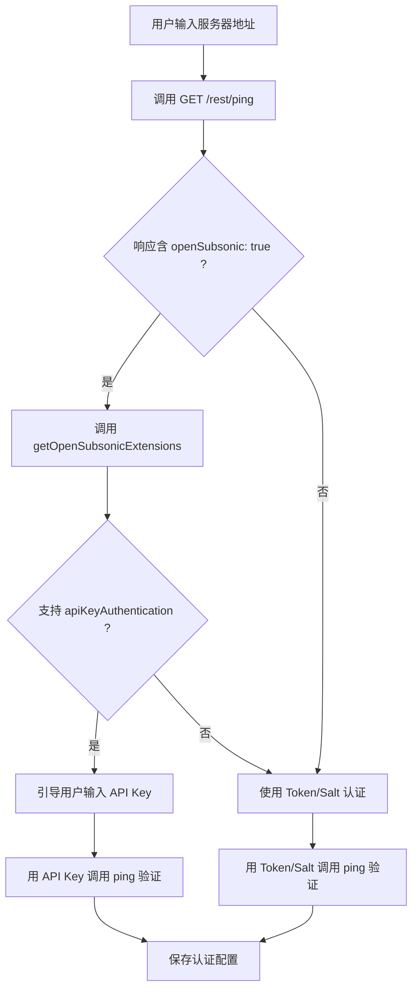
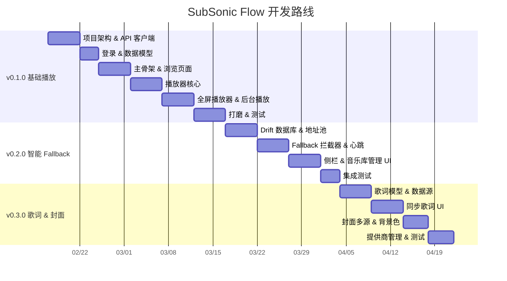

# SubSonic Flow — Navidrome 手机客户端产品规划书

> **版本**: v0.1 Draft  
> **日期**: 2026-02-10  
> **目标平台**: Android / iOS（Flutter 跨平台）

---

## 1. 产品定位

**SubSonic Flow** 是一款面向 Navidrome 自建音乐服务的高品质移动客户端，核心解决以下痛点：

| 痛点         | 现有客户端现状 | SubSonic Flow 方案                |
| ------------ | -------------- | --------------------------------- |
| 多服务器管理 | 仅支持单后端   | 支持多后端 + 多地址智能 Fallback  |
| 网络环境复杂 | 手动切换地址   | 按优先级自动探测、无感切换        |
| 音质控制     | 有限或无法控制 | 全面的转码/直连音质选项           |
| 离线与缓存   | 简单的手动下载 | 基于听歌频率的智能缓存 + 手动下载 |
| 歌词/封面    | 仅依赖服务端   | 可切换公共/私有歌词、封面提供商   |

---

## 2. 核心功能模块

### 2.1 多后端 & 多地址智能 Fallback

这是本产品的**第一亮点**，架构如下：



#### 数据模型

```
音乐库记录 (MusicLibrary)
├── id: UUID
├── name: "家庭 NAS"
├── user: { username, password/token }
├── addresses: [
│     { label: "内网",    url: "http://192.168.1.100:4533", priority: 1 },
│     { label: "IPv6",    url: "http://[2001:db8::1]:4533", priority: 2 },
│     { label: "FRP穿透", url: "https://nas.example.com",   priority: 3 },
│     { label: "公网v4",  url: "https://ddns.example.com",  priority: 4 },
│   ]
├── activeAddress: 当前生效地址
└── status: connected / fallback / offline
```

#### Fallback 策略

1. **启动时**：按用户排序（优先级）逐一探测延迟（HEAD 请求 `/rest/ping`），选择首个可达地址
2. **运行中**：后台每 30s 心跳检测当前地址
3. **切换时**：当前地址连续 2 次超时 → 自动尝试下一优先级地址 → 切换成功后 Toast 提示
4. **回落恢复**：高优先级地址恢复可达时，可选自动回切（用户可关闭）
5. **用户可手动拖动排序**地址优先级，也可手动锁定某地址

---

### 2.2 高品质音频播放

| 功能           | 说明                                                                     |
| -------------- | ------------------------------------------------------------------------ |
| 音质选项       | 原始直连（FLAC/WAV/APE）、高品质 320kbps、标准 192kbps、流量节省 128kbps |
| 按网络自动切换 | Wi-Fi 下使用原始/高品质，移动数据下使用标准/节省（可配置）               |
| 无缝播放       | Gapless playback，支持 crossfade 淡入淡出                                |
| 音频引擎       | 基于平台原生解码（Android: ExoPlayer / iOS: AVAudioEngine）              |
| 均衡器         | 内置多频段 EQ + 预设（流行、摇滚、古典等）                               |
| ReplayGain     | 支持按专辑/按曲目音量标准化                                              |

#### 转码请求流程

```
用户选择「高品质 320kbps」
   ↓
客户端请求: /rest/stream?id=xxx&maxBitRate=320&format=mp3
   ↓
Navidrome 服务端转码返回
   ↓
客户端播放 + 缓存转码后的文件
```

---

### 2.3 歌词 & 封面提供商切换



- **公共提供商**：LRCLIB、网易云音乐、QQ音乐歌词接口等（内置）
- **私有提供商**：用户可配置自建歌词 / 封面 API 地址
- **优先级**：服务端内嵌 > 用户自定义 > 公共提供商（可拖拽排序）
- **封面同理**：Navidrome 服务端 > Fanart.tv > MusicBrainz > 自定义源

---

### 2.4 下载 & 智能缓存

#### 手动下载

- 支持按曲目、专辑、歌单批量下载
- 可选择下载音质（原始 / 转码）
- 下载管理器：进度、暂停/恢复、删除
- 存储路径可配置

#### 智能缓存（边听边缓存）



**缓存策略**：

| 参数         | 默认值             | 说明                          |
| ------------ | ------------------ | ----------------------------- |
| 最大缓存空间 | 2 GB               | 用户可调整                    |
| 淘汰算法     | **LFU + LRU 混合** | 优先淘汰低播放频率 + 最久未听 |
| 缓存保护     | 播放 ≥ 5 次        | 高频歌曲不参与自动淘汰        |
| 预缓存       | 下一首             | 播放队列中预缓存下一首歌      |

---

## 3. UI 架构设计

### 3.1 整体布局

```
┌──────────────────────────────────┐
│  ☰ 侧栏触发    顶部标题栏        │
├──────────────────────────────────┤
│                                  │
│         内容区域                  │
│    (根据底栏选项切换)              │
│                                  │
│                                  │
├──────────────────────────────────┤
│  🎵 迷你播放器 (当前曲目/进度)     │
├──────────────────────────────────┤
│   🎶 音乐流   │   👤 我的        │
│   (Tab 1)     │   (Tab 2)       │
└──────────────────────────────────┘
```

---

### 3.2 Tab 1 — 音乐流 🎶



> 首页信息流，展示个性化推荐，让用户快速「续听」

#### 页面结构

```
音乐流
├── 🔍 搜索栏
├── 📌 继续收听 (最近播放的 5 首，横向滑动)
├── 🔥 经常听的歌曲 (按播放次数排序，网格/列表切换)
├── 📋 经常听的歌单 (横向卡片轮播)
├── 💿 经常听的专辑 (大封面网格)
└── 🎲 随机推荐 (服务端 getRandomSongs)
```

**设计要点**：

- 大封面卡片设计，视觉冲击力强
- 每个区块右上角「查看全部」可展开完整列表
- 下拉刷新获取最新数据

---

### 3.3 Tab 2 — 我的 👤

> 当前音乐库的个人空间

#### 页面结构

```
我的
├── 📋 我的歌单
│     ├── ❤️ 收藏夹 (starred)
│     ├── 用户创建的歌单 1
│     ├── 用户创建的歌单 2
│     └── ＋ 新建歌单
│
├── 📚 音乐库浏览
│     ├── 💿 按专辑浏览
│     │     └── 专辑列表 → 专辑详情 (曲目列表)
│     ├── 📁 按文件夹浏览
│     │     └── 文件夹树 → 文件列表
│     └── 🎤 按歌手浏览
│           └── 歌手列表 → 歌手详情 (专辑 + 热门曲目)
│
├── ⬇️ 已下载
│     └── 离线可用的曲目/专辑
│
└── ⚙️ 播放统计
       └── 最多播放 / 最近播放 / 播放时长统计
```

---

### 3.4 侧栏 — 音乐库 & 用户管理



> 侧栏是音乐库生命周期管理入口

```
侧栏
├── 🏷️ 当前音乐库名 (点击切换)
│      ├── ✅ 家庭 NAS (已连接 - 内网)
│      ├── 🔄 公司服务器 (Fallback - 公网)
│      └── ＋ 添加音乐库
│
├── ⚙️ 音乐库设置 (当前选中)
│      ├── 编辑名称
│      ├── 管理地址池 (添加/排序/删除地址)
│      ├── 用户凭据管理
│      └── 连接状态 & 延迟测试
│
├── 🎵 播放设置
│      ├── 音质选择
│      ├── 均衡器
│      └── Gapless / Crossfade
│
├── 📥 缓存管理
│      ├── 缓存空间使用情况
│      ├── 清除缓存
│      └── 缓存策略设置
│
├── 🔤 歌词/封面提供商
│      ├── 歌词源排序
│      └── 封面源排序
│
└── ℹ️ 关于
```

#### 添加音乐库流程



---

## 4. 全屏播放器



```
┌──────────────────────────────────┐
│  ← 收起        ··· 更多          │
│                                  │
│         ┌──────────────┐         │
│         │              │         │
│         │   专辑封面    │         │
│         │   (大图)     │         │
│         │              │         │
│         └──────────────┘         │
│                                  │
│    曲目名称                       │
│    歌手 - 专辑名                  │
│                                  │
│   advancement bar: ──●───── 3:24  │
│                                  │
│    🔀    ⏮️    ▶️    ⏭️    🔁     │
│                                  │
│  🔉 ─────●──────────── 🔊       │
│                                  │
│  ♡    📥    📋    🎤 歌词        │
│                                  │
│  ┌ 歌词展示区 (可上下滑动) ──────┐ │
│  │  ...                         │ │
│  │  ▶ 当前歌词行 (高亮)          │ │
│  │  ...                         │ │
│  └──────────────────────────────┘ │
│                                  │
│  当前音质: FLAC · 内网           │
└──────────────────────────────────┘
```

---

## 5. 技术选型

| 层级     | 技术方案                           | 说明                               |
| -------- | ---------------------------------- | ---------------------------------- |
| 框架     | **Flutter**                        | 跨平台，一套代码覆盖 Android / iOS |
| 状态管理 | **Riverpod**                       | 声明式、可测试、类型安全           |
| 音频引擎 | **just_audio** + **audio_service** | 后台播放、通知栏控制、Gapless      |
| 网络     | **Dio** + 自定义 Interceptor       | 地址池 Fallback 拦截器自动切换     |
| 本地存储 | **Drift (SQLite)**                 | 缓存元数据、播放统计、配置         |
| 缓存     | **自研文件缓存管理器**             | LFU+LRU 混合淘汰策略               |
| API 协议 | **Subsonic API**                   | Navidrome 完整兼容 Subsonic API    |
| 设计     | **Material 3** + 自定义主题        | 支持 Dynamic Color / 深色模式      |

### Fallback 网络层架构

```dart
// 伪代码：Dio Interceptor 实现自动 Fallback
class FallbackInterceptor extends Interceptor {
  @override
  void onError(DioException err, ErrorInterceptorHandler handler) {
    if (isConnectionError(err)) {
      // 标记当前地址不可用
      addressPool.markFailed(currentAddress);
      // 获取下一个可用地址
      final next = addressPool.getNextAvailable();
      if (next != null) {
        // 用新地址重试请求
        final retryOptions = err.requestOptions.copyWith(baseUrl: next.url);
        return handler.resolve(await dio.fetch(retryOptions));
      }
    }
    return handler.next(err);
  }
}
```

---

## 6. 开发路线图

### Phase 1 — MVP（8 周）

- [x] 项目脚手架 & 基础架构
- [x] 音乐库管理（单后端 + 多地址 + Fallback）
- [x] Subsonic API 接入（认证 / 歌曲 / 专辑 / 歌手 / 歌单）
- [x] 底栏两 Tab + 侧栏基础 UI
- [x] 音频播放器（基础播放 / 播放队列 / 后台播放）
- [x] 迷你播放器 + 全屏播放器

### Phase 2 — 体验增强（6 周）

- [x] 多后端支持
- [ ] 音质切换 & 按网络自动切换
- [x] 歌词展示 + 提供商切换
- [x] 封面提供商切换
- [ ] 下载管理器
- [ ] 边听边缓存 + 智能淘汰

### Phase 3 — 精打细磨（4 周）

- [ ] 均衡器 & ReplayGain
- [ ] Gapless / Crossfade
- [ ] 播放统计可视化
- [ ] 深色模式 & Dynamic Color
- [ ] 性能优化 & 上架准备

---

## 7. 竞品对比

| 功能                   | SubSonic Flow |  Symfonium   |  Ultrasonic  | Subtracks |
| ---------------------- | :-----------: | :----------: | :----------: | :-------: |
| 多后端                 |      ✅       |      ✅      |      ❌      |    ❌     |
| 多地址 + 自动 Fallback |      ✅       |      ❌      |      ❌      |    ❌     |
| 音质切换               |      ✅       |      ✅      |      ✅      |    ❌     |
| 智能缓存               |      ✅       |     部分     |      ❌      |    ❌     |
| 歌词/封面提供商切换    |      ✅       |     部分     |      ❌      |    ❌     |
| 离线下载               |      ✅       |      ✅      |      ✅      |    ❌     |
| 跨平台                 | ✅ (Flutter)  | ❌ (Android) | ❌ (Android) |  ✅ (RN)  |
| 开源                   |      ✅       |      ❌      |      ✅      |    ✅     |

---

## 8. 总结

**SubSonic Flow** 的核心差异化在于：

1. **多地址智能 Fallback** — 真正解决复杂网络环境下的无缝连接
2. **灵活的提供商机制** — 歌词、封面不再受限于服务端
3. **频率驱动的智能缓存** — 越常听的歌曲，离线可用性越高
4. **跨平台 + 开源** — Flutter 覆盖双端，社区共建

以上为 v0.1 初版规划，待进一步细化 UI 原型与技术 POC 后迭代更新。

---

## 9. 实现计划

> 以下为按版本划分的详细实现计划。每个版本都包含目录结构、依赖清单、涉及的 Subsonic API、实现步骤和验收标准。

---

### v0.1.0 — 最基础的能听歌 🎵

> **目标**：用户可以连接到一个 Navidrome 服务器，浏览音乐库，播放歌曲，并在后台继续播放。
> **预计工期**：4 周

#### 9.1.1 目录结构

```
lib/
├── main.dart                           # 应用入口
├── app.dart                            # MaterialApp 配置、主题、路由
│
├── core/
│   ├── constants/
│   │   └── api_constants.dart          # Subsonic API 路径常量、默认配置
│   ├── theme/
│   │   ├── app_theme.dart              # Material 3 主题定义（亮/暗）
│   │   └── color_scheme.dart           # 颜色方案
│   └── utils/
│       ├── subsonic_auth.dart          # Subsonic 认证参数生成（salt + token）
│       └── logger.dart                 # 日志工具
│
├── data/
│   ├── models/
│   │   ├── server_config.dart          # 服务器配置模型（url, username, token...）
│   │   ├── song.dart                   # 歌曲模型
│   │   ├── album.dart                  # 专辑模型
│   │   ├── artist.dart                 # 歌手模型
│   │   └── playlist.dart               # 歌单模型
│   ├── repositories/
│   │   ├── auth_repository.dart        # 认证仓库（登录、验证连接）
│   │   ├── music_repository.dart       # 音乐数据仓库（歌曲/专辑/歌手查询）
│   │   └── playlist_repository.dart    # 歌单仓库
│   └── sources/
│       ├── subsonic_api_client.dart     # Dio 封装，统一请求 Subsonic API
│       └── local_storage.dart          # SharedPreferences 封装（服务器配置持久化）
│
├── providers/
│   ├── auth_provider.dart              # 认证状态（Riverpod）
│   ├── music_provider.dart             # 音乐数据状态
│   ├── player_provider.dart            # 播放器状态（当前曲目、播放队列、播放状态）
│   └── navigation_provider.dart        # 导航状态（当前 Tab）
│
├── features/
│   ├── auth/
│   │   └── pages/
│   │       └── login_page.dart         # 登录页（输入服务器地址 + 用户名 + 密码）
│   ├── discover/                       # Tab 1 — 音乐流
│   │   ├── pages/
│   │   │   └── discover_page.dart      # 音乐流首页
│   │   └── widgets/
│   │       ├── recent_songs_section.dart    # 最近播放
│   │       ├── frequent_songs_section.dart  # 经常听的歌曲
│   │       └── random_songs_section.dart    # 随机推荐
│   ├── library/                        # Tab 2 — 我的
│   │   ├── pages/
│   │   │   ├── library_page.dart       # 我的首页
│   │   │   ├── album_list_page.dart    # 专辑列表
│   │   │   ├── album_detail_page.dart  # 专辑详情（曲目列表）
│   │   │   ├── artist_list_page.dart   # 歌手列表
│   │   │   ├── artist_detail_page.dart # 歌手详情
│   │   │   └── playlist_detail_page.dart # 歌单详情
│   │   └── widgets/
│   │       ├── album_grid_item.dart    # 专辑网格卡片
│   │       ├── song_list_tile.dart     # 歌曲列表项
│   │       └── artist_list_tile.dart   # 歌手列表项
│   └── player/
│       ├── pages/
│       │   └── full_player_page.dart   # 全屏播放器
│       └── widgets/
│           ├── mini_player.dart        # 底部迷你播放器
│           └── play_queue_sheet.dart   # 播放队列底部弹窗
│
└── widgets/
    ├── main_scaffold.dart              # 主骨架（底栏 + 迷你播放器 + 内容区）
    └── cover_art_image.dart            # 封面图组件（从服务端 getCoverArt 获取）
```

#### 9.1.2 依赖清单

```yaml
dependencies:
  flutter:
    sdk: flutter
  # 状态管理
  flutter_riverpod: ^2.6.1
  riverpod_annotation: ^2.6.1
  # 网络
  dio: ^5.7.0
  # 音频播放
  just_audio: ^0.9.42
  audio_service: ^0.18.17
  just_audio_background: ^0.0.1-beta.13   # 或使用 audio_service 手动集成
  # 本地存储
  shared_preferences: ^2.3.4
  # 工具
  crypto: ^3.0.6                          # MD5 用于 Subsonic 认证
  uuid: ^4.5.1
  cached_network_image: ^3.4.1            # 封面缓存
  go_router: ^14.8.1                      # 声明式路由

dev_dependencies:
  flutter_test:
    sdk: flutter
  flutter_lints: ^6.0.0
  riverpod_generator: ^2.6.3
  build_runner: ^2.4.14
```

#### 9.1.3 涉及的 OpenSubsonic API

> **协议基础**：[OpenSubsonic API](https://opensubsonic.netlify.app/) 是 Subsonic API 的超集，向后兼容传统 Subsonic API，同时引入了服务器标识、扩展发现、API Key 认证、结构化歌词等增强能力。
>
> **响应格式**：OpenSubsonic 的 JSON 响应在 `subsonic-response` 中额外包含：
>
> - `type`: 服务器名称（如 `"navidrome"`）
> - `serverVersion`: 服务器版本
> - `openSubsonic`: `true`（标识该服务器支持 OpenSubsonic）

##### 系统 & 认证

| 端点                                  | 用途         | 说明                                                                                                                                           |
| ------------------------------------- | ------------ | ---------------------------------------------------------------------------------------------------------------------------------------------- |
| `GET /rest/ping`                      | 连接测试     | 验证服务器地址与认证是否有效；OpenSubsonic 响应额外返回 `type`、`serverVersion`、`openSubsonic` 字段                                           |
| `GET /rest/getOpenSubsonicExtensions` | 扩展发现     | 🆕 **OpenSubsonic**。返回服务器支持的扩展列表（如 `songLyrics`、`apiKeyAuthentication`、`transcoding`、`formPost` 等），客户端据此判断可用功能 |
| `GET /rest/tokenInfo`                 | API Key 信息 | 🆕 **OpenSubsonic**。返回当前 API Key 的信息（关联用户、权限等）                                                                               |

##### 浏览 & 搜索

| 端点                          | 用途             | 说明                                                                    |
| ----------------------------- | ---------------- | ----------------------------------------------------------------------- |
| `GET /rest/getAlbumList2`     | 获取专辑列表     | 支持 `type=recent/frequent/newest/random/starred/alphabeticalByName` 等 |
| `GET /rest/getAlbum`          | 获取专辑详情     | 返回专辑内的曲目列表，OpenSubsonic 响应中曲目包含额外字段               |
| `GET /rest/getArtists`        | 获取歌手列表     | 按字母索引返回所有歌手                                                  |
| `GET /rest/getArtist`         | 获取歌手详情     | 返回歌手的专辑列表                                                      |
| `GET /rest/getArtistInfo2`    | 获取歌手信息     | 返回歌手简介、相似歌手、MusicBrainz ID 等                               |
| `GET /rest/getSong`           | 获取单曲详情     | 返回单个歌曲的完整元数据                                                |
| `GET /rest/getTopSongs`       | 获取歌手热门歌曲 | 返回指定歌手的热门曲目                                                  |
| `GET /rest/getRandomSongs`    | 随机歌曲         | 音乐流首页的随机推荐，支持 `genre`、`fromYear`、`toYear` 过滤           |
| `GET /rest/getGenres`         | 获取流派列表     | 返回所有音乐流派                                                        |
| `GET /rest/getSongsByGenre`   | 按流派获取歌曲   | 返回指定流派的歌曲                                                      |
| `GET /rest/search3`           | 搜索             | 搜索歌曲/专辑/歌手，支持分页                                            |
| `GET /rest/getMusicFolders`   | 获取音乐文件夹   | 按文件夹浏览的根入口                                                    |
| `GET /rest/getMusicDirectory` | 获取文件夹内容   | 按文件夹浏览时获取子目录/文件                                           |
| `GET /rest/getIndexes`        | 获取索引         | 返回所有歌手的索引结构                                                  |

##### 歌单 & 收藏

| 端点                        | 用途          | 说明                         |
| --------------------------- | ------------- | ---------------------------- |
| `GET /rest/getPlaylists`    | 获取歌单列表  | 用户可访问的所有歌单         |
| `GET /rest/getPlaylist`     | 获取歌单详情  | 歌单内所有曲目               |
| `POST /rest/createPlaylist` | 创建/更新歌单 | 创建新歌单或更新已有歌单     |
| `POST /rest/updatePlaylist` | 更新歌单      | 修改歌单名称、描述、增删曲目 |
| `POST /rest/deletePlaylist` | 删除歌单      | 删除指定歌单                 |
| `GET /rest/getStarred2`     | 获取收藏      | ❤️ 收藏的曲目/专辑/歌手      |
| `POST /rest/star`           | 添加收藏      | 标记歌曲/专辑/歌手为收藏     |
| `POST /rest/unstar`         | 取消收藏      | 取消收藏标记                 |
| `POST /rest/setRating`      | 设置评分      | 为歌曲/专辑设置 1-5 星评分   |

##### 媒体播放

| 端点                    | 用途     | 说明                                                                                                                                                                |
| ----------------------- | -------- | ------------------------------------------------------------------------------------------------------------------------------------------------------------------- |
| `GET /rest/stream`      | 流式播放 | 核心播放接口。参数：`id`（必填）、`maxBitRate`、`format`、`estimateContentLength`。**OpenSubsonic 规范**：访问此接口不计入播放次数，需使用 `scrobble` 显式上报      |
| `GET /rest/getCoverArt` | 获取封面 | 专辑/歌曲封面图片，参数 `id` + 可选 `size`                                                                                                                          |
| `GET /rest/download`    | 下载文件 | 下载原始媒体文件（不转码）                                                                                                                                          |
| `POST /rest/scrobble`   | 上报播放 | 🆕 **OpenSubsonic 强调**。上报播放记录（更新播放次数、Last.fm scrobble、"正在播放"），参数 `id`、`time`（播放时间戳）、`submission`（true=完成播放/false=正在播放） |

##### 播放队列同步

| 端点                       | 用途         | 说明                                                                                                                         |
| -------------------------- | ------------ | ---------------------------------------------------------------------------------------------------------------------------- |
| `GET /rest/getPlayQueue`   | 获取播放队列 | 获取该用户服务端保存的播放队列状态                                                                                           |
| `POST /rest/savePlayQueue` | 保存播放队列 | 保存当前播放队列到服务端，支持跨设备同步。参数 `id`（曲目 ID 列表）、`current`（当前播放曲目 ID）、`position`（播放位置 ms） |

#### 9.1.4 OpenSubsonic 认证机制

客户端应支持两种认证方式，并在连接时自动检测使用哪种：

##### 方式 1：API Key 认证（推荐，OpenSubsonic 扩展）

```
请求附带以下 Query 参数：
  apiKey = 服务器生成的 API Key
  v = 1.16.1           (API 版本)
  c = echo             (客户端标识)
  f = json             (返回格式)

注意：使用 apiKey 时不得传 u 参数，否则服务器返回 error 43
```

##### 方式 2：Token/Salt 认证（传统 Subsonic，兼容回退）

```
请求附带以下 Query 参数：
  u = 用户名
  t = MD5(密码 + salt)
  s = 随机 salt
  v = 1.16.1           (API 版本)
  c = echo             (客户端标识)
  f = json             (返回格式)
```

##### 认证检测流程



##### OpenSubsonic 扩展能力记录

连接成功后，客户端应缓存 `getOpenSubsonicExtensions` 的结果，后续按需启用功能：

| 扩展名                 | 用途                                                              | 涉及版本 |
| ---------------------- | ----------------------------------------------------------------- | -------- |
| `apiKeyAuthentication` | API Key 认证                                                      | v0.1.0   |
| `songLyrics`           | 结构化歌词 `getLyricsBySongId`                                    | v0.3.0   |
| `transcoding`          | 转码决策 `getTranscodeDecision` + `getTranscodeStream`            | 未来版本 |
| `transcodeOffset`      | 流媒体播放偏移 `stream?timeOffset=`                               | 未来版本 |
| `formPost`             | HTTP POST 请求支持                                                | v0.1.0   |
| `indexBasedQueue`      | 基于索引的播放队列 `getPlayQueueByIndex` / `savePlayQueueByIndex` | 未来版本 |

#### 9.1.5 实现步骤

| #   | 任务                        | 详细描述                                                                                                                                                                                                                                                                                                                                                                                                         | 验收标准                                             |
| --- | --------------------------- | ---------------------------------------------------------------------------------------------------------------------------------------------------------------------------------------------------------------------------------------------------------------------------------------------------------------------------------------------------------------------------------------------------------------- | ---------------------------------------------------- |
| 1   | **项目基础架构搭建**        | 按 9.1.1 创建目录结构；配置 `pubspec.yaml` 添加依赖；创建 `app.dart` 配置 Material 3 主题（亮色 + 暗色）、GoRouter 路由                                                                                                                                                                                                                                                                                          | 项目可编译运行，显示空白主页                         |
| 2   | **OpenSubsonic API 客户端** | 实现 `subsonic_api_client.dart`：封装 Dio 实例，配置 `baseUrl`；实现认证拦截器：同时支持 **API Key** 和 **Token/Salt** 两种认证方式，统一注入请求 query params；首次连接时调用 `ping` 检测 `openSubsonic` 字段 → 若为 `true` 则调用 `getOpenSubsonicExtensions` 缓存扩展列表 → 检测是否支持 `apiKeyAuthentication` 引导对应认证流程                                                                              | 调用 `/rest/ping` 返回 `ok`，扩展列表正确缓存        |
| 3   | **登录页面**                | 实现 `login_page.dart`：Step 1 输入服务器地址 → 自动探测是否为 OpenSubsonic 服务器；Step 2 根据检测结果展示 API Key 输入框或用户名+密码输入框；调用 `ping` 验证连接；成功后将配置写入 `SharedPreferences`；下次启动自动读取已保存配置跳转主页                                                                                                                                                                    | 输入正确信息可登录，支持两种认证方式，错误信息有提示 |
| 4   | **数据模型 & Repository**   | 实现 `song.dart`、`album.dart`、`artist.dart`、`playlist.dart` 数据模型（fromJson）；实现 `music_repository.dart`：封装专辑列表、歌手列表、随机歌曲、搜索等查询；实现 `playlist_repository.dart`                                                                                                                                                                                                                 | 各 Repository 方法可返回正确解析的数据               |
| 5   | **主骨架 UI**               | 实现 `main_scaffold.dart`：底部导航栏（音乐流 / 我的）+ 内容区域切换；顶部标题栏；预留迷你播放器位置                                                                                                                                                                                                                                                                                                             | 底部 Tab 可切换，页面可正常显示                      |
| 6   | **音乐流页面（Tab 1）**     | 实现 `discover_page.dart`：调用 `getRandomSongs` 展示随机推荐（网格布局）；`getAlbumList2?type=recent` 展示最近播放专辑（横向滚动卡片）；`getAlbumList2?type=frequent` 展示常听专辑                                                                                                                                                                                                                              | 页面展示三个区块，数据从服务端获取                   |
| 7   | **我的页面（Tab 2）**       | 实现 `library_page.dart`：展示歌单列表入口、按专辑/歌手/文件夹浏览入口；实现 `album_list_page.dart` + `album_detail_page.dart`；实现 `artist_list_page.dart` + `artist_detail_page.dart`；实现 `playlist_detail_page.dart`                                                                                                                                                                                       | 可浏览专辑、歌手、歌单并查看详情                     |
| 8   | **音频播放器核心**          | 集成 `just_audio` + `audio_service`：实现 `player_provider.dart` 管理播放状态（当前曲目、播放/暂停、进度、播放队列）；音频源 URL = `baseUrl + /rest/stream?id=xxx&认证参数`；支持播放、暂停、上一首、下一首、拖动进度；播放开始时调用 `scrobble(id, submission=false)` 上报「正在播放」，播放完成/超过 50% 时调用 `scrobble(id, submission=true)` 上报「已播放」（因 OpenSubsonic 规范中 `stream` 不计播放次数） | 点击歌曲可播放，基本控制正常，scrobble 上报正确      |
| 9   | **迷你播放器**              | 实现 `mini_player.dart`：底部固定条，显示当前曲目封面缩略图、曲名、歌手、播放/暂停按钮；点击展开全屏播放器                                                                                                                                                                                                                                                                                                       | 播放时底部显示迷你播放器                             |
| 10  | **全屏播放器**              | 实现 `full_player_page.dart`：大封面图、曲名、歌手-专辑、进度条、播放控制（上一首/播放暂停/下一首/随机/循环）、音量条；播放队列按钮 → 展开 `play_queue_sheet.dart`                                                                                                                                                                                                                                               | 全屏播放器 UI 完整、控制功能可用                     |
| 11  | **后台播放 & 通知栏**       | 配置 `audio_service`：Android 前台通知 + 锁屏控制；iOS 控制中心集成；后台不被系统杀死                                                                                                                                                                                                                                                                                                                            | 切到后台/锁屏后音乐继续播放，通知栏可控制            |
| 12  | **收藏 & 搜索**             | 实现 `star` / `unstar` API 调用：歌曲列表项和全屏播放器的爱心按钮；实现 `search3` 搜索功能：音乐流页面顶部搜索栏                                                                                                                                                                                                                                                                                                 | 可收藏/取消收藏歌曲，搜索返回结果可点击播放          |
| 13  | **打磨 & 测试**             | UI 细节打磨：加载状态（Shimmer）、空状态、错误重试；播放器边界情况（播放队列为空、网络中断重试）；Android + iOS 真机测试                                                                                                                                                                                                                                                                                         | 无明显 crash，体验流畅                               |

#### 9.1.6 v0.1.0 验收标准（整体）

- [x] 可连接到一个 Navidrome 服务器并认证通过
- [x] 可浏览专辑、歌手、歌单
- [x] 可搜索音乐
- [x] 可播放、暂停、切歌、拖动进度
- [x] 播放队列管理正常
- [x] 后台播放 + 通知栏控制正常
- [x] 迷你播放器和全屏播放器正常
- [x] 应用可在 Android / iOS 真机运行

---

### v0.2.0 — 多地址智能 Fallback 🔄

> **目标**：用户可以为一个音乐库配置多个地址，应用自动按优先级探测并切换，运行中连接失败时自动 Fallback 到下一个地址。
> **前置版本**：v0.1.0
> **预计工期**：3 周

#### 9.2.1 新增/修改目录结构

```
lib/
├── core/
│   └── network/
│       ├── fallback_interceptor.dart    # 🆕 Dio 拦截器：请求失败自动切换地址
│       ├── address_pool.dart            # 🆕 地址池管理（排序、探测、切换）
│       ├── health_checker.dart          # 🆕 后台心跳检测服务
│       └── connectivity_monitor.dart    # 🆕 网络状态变化监听
│
├── data/
│   ├── models/
│   │   ├── server_address.dart          # 🆕 单个地址模型（label, url, priority, latency, status）
│   │   └── music_library.dart           # 🆕 音乐库模型（替代简单的 server_config）
│   ├── repositories/
│   │   └── library_repository.dart      # 🆕 音乐库 CRUD（本地持久化）
│   └── sources/
│       └── database/
│           ├── app_database.dart        # 🆕 Drift 数据库定义
│           └── tables/
│               ├── music_libraries_table.dart  # 🆕 音乐库表
│               └── server_addresses_table.dart # 🆕 地址表
│
├── providers/
│   ├── library_provider.dart            # 🆕 音乐库列表状态
│   └── connection_provider.dart         # 🆕 当前连接状态（地址、延迟、Fallback 状态）
│
├── features/
│   ├── auth/
│   │   └── pages/
│   │       └── login_page.dart          # ✏️ 改为「添加音乐库」流程
│   ├── library_management/              # 🆕 音乐库管理（侧栏入口）
│   │   ├── pages/
│   │   │   ├── library_list_page.dart   # 🆕 音乐库列表 + 切换
│   │   │   ├── library_edit_page.dart   # 🆕 编辑音乐库（名称、凭据）
│   │   │   └── address_pool_page.dart   # 🆕 地址池管理（添加/排序/删除/测速）
│   │   └── widgets/
│   │       ├── address_tile.dart        # 🆕 地址列表项（拖拽排序、延迟显示、状态灯）
│   │       ├── latency_indicator.dart   # 🆕 延迟指示器
│   │       └── connection_status_badge.dart # 🆕 连接状态徽章
│   └── sidebar/
│       └── sidebar_drawer.dart          # 🆕 侧栏抽屉（音乐库切换 + 设置入口）
```

#### 9.2.2 新增依赖

```yaml
dependencies:
  # 本地数据库（替代 SharedPreferences 做结构化存储）
  drift: ^2.22.1
  sqlite3_flutter_libs: ^0.5.28
  path_provider: ^2.1.5
  path: ^1.9.1
  # 网络状态监听
  connectivity_plus: ^6.1.1
  # 可拖拽排序列表
  reorderable_list_view: 通过 Flutter 内置 ReorderableListView
  # Toast 提示
  fluttertoast: ^8.2.10

dev_dependencies:
  drift_dev: ^2.22.1
```

#### 9.2.3 核心模块设计

##### (a) 地址池管理 `AddressPool`

```dart
/// 地址池：管理一个音乐库的多个地址
class AddressPool {
  List<ServerAddress> addresses;    // 按 priority 排序
  ServerAddress? activeAddress;     // 当前活跃地址

  /// 启动时全量探测，选择最优可达地址
  Future<ServerAddress?> probeAll();

  /// 标记某地址探测失败
  void markFailed(ServerAddress addr);

  /// 获取下一个可用地址（按优先级）
  ServerAddress? getNextAvailable();

  /// 切换到指定地址
  Future<bool> switchTo(ServerAddress addr);

  /// 用户手动锁定某地址（不参与自动切换）
  void lockAddress(ServerAddress addr);
}
```

##### (b) Fallback 拦截器 `FallbackInterceptor`

```dart
/// Dio 拦截器：自动 Fallback
class FallbackInterceptor extends Interceptor {
  final AddressPool addressPool;
  int consecutiveFailures = 0;

  @override
  void onRequest(RequestOptions options, ...) {
    // 将 baseUrl 替换为当前活跃地址
    options.baseUrl = addressPool.activeAddress!.url;
  }

  @override
  void onError(DioException err, ...) {
    if (isConnectionError(err)) {
      consecutiveFailures++;
      if (consecutiveFailures >= 2) {   // 连续 2 次失败
        final next = addressPool.getNextAvailable();
        if (next != null) {
          addressPool.switchTo(next);
          // 用新地址重试原请求
          return retryWithNewAddress(err.requestOptions, next);
        }
      }
    } else {
      consecutiveFailures = 0;       // 非连接错误重置计数
    }
  }
}
```

##### (c) 心跳检测 `HealthChecker`

```dart
/// 后台心跳服务
class HealthChecker {
  Timer? _timer;

  void start() {
    _timer = Timer.periodic(Duration(seconds: 30), (_) => _check());
  }

  Future<void> _check() async {
    // 1. HEAD /rest/ping 检测当前地址
    // 2. 如果失败 → 触发 Fallback
    // 3. 如果当前在 Fallback 状态，额外检测高优先级地址
    //    → 高优先级恢复则可选回切
  }
}
```

#### 9.2.4 涉及的 OpenSubsonic API（新增）

| 端点                                  | 用途               | 说明                                                                               |
| ------------------------------------- | ------------------ | ---------------------------------------------------------------------------------- |
| `HEAD /rest/ping`                     | 心跳检测           | 仅检测连通性，不返回 body                                                          |
| `GET /rest/ping`                      | 全量探测           | 启动时验证各地址可达性；OpenSubsonic 响应含 `type`、`serverVersion` 可用于 UI 展示 |
| `GET /rest/getOpenSubsonicExtensions` | 地址切换后重新检测 | 切换地址后需重新获取扩展列表，因不同地址可能指向不同服务器                         |

#### 9.2.5 数据库 Schema（Drift）

```sql
-- 音乐库表
CREATE TABLE music_libraries (
  id        TEXT PRIMARY KEY,       -- UUID
  name      TEXT NOT NULL,          -- 显示名
  auth_type TEXT NOT NULL DEFAULT 'token',  -- 'apikey' / 'token'
  username  TEXT,                   -- Token/Salt 认证时使用
  password  TEXT,                   -- Token/Salt 认证时使用，加密存储
  api_key   TEXT,                   -- API Key 认证时使用，加密存储
  server_type TEXT,                 -- 服务端名称（来自 ping 响应的 type 字段）
  server_version TEXT,              -- 服务端版本（来自 ping 响应的 serverVersion 字段）
  is_open_subsonic INTEGER DEFAULT 0,  -- 是否支持 OpenSubsonic
  extensions TEXT,                  -- JSON，缓存 getOpenSubsonicExtensions 结果
  is_active INTEGER DEFAULT 0,     -- 当前选中的音乐库
  created_at INTEGER NOT NULL,
  updated_at INTEGER NOT NULL
);

-- 地址表
CREATE TABLE server_addresses (
  id          TEXT PRIMARY KEY,     -- UUID
  library_id  TEXT NOT NULL REFERENCES music_libraries(id) ON DELETE CASCADE,
  label       TEXT NOT NULL,        -- "内网" / "IPv6" / ...
  url         TEXT NOT NULL,
  priority    INTEGER NOT NULL,     -- 越小越优先
  is_locked   INTEGER DEFAULT 0,   -- 用户手动锁定
  last_latency_ms INTEGER,         -- 最近一次延迟
  last_status  TEXT DEFAULT 'unknown'  -- unknown / ok / failed
);
```

#### 9.2.6 实现步骤

| #   | 任务                                        | 详细描述                                                                                                                                                                                  | 验收标准                             |
| --- | ------------------------------------------- | ----------------------------------------------------------------------------------------------------------------------------------------------------------------------------------------- | ------------------------------------ |
| 1   | **引入 Drift 数据库**                       | 配置 `drift` + `drift_dev`；创建 `app_database.dart`、`music_libraries_table.dart`、`server_addresses_table.dart`；实现 `library_repository.dart`（CRUD）                                 | 数据库可创建，音乐库和地址可增删改查 |
| 2   | **数据迁移：从 SharedPreferences 到 Drift** | 应用启动时检测旧格式配置，自动迁移到数据库；旧 `server_config` 转为 `MusicLibrary` + 一条 `ServerAddress`                                                                                 | 老用户升级不丢失配置                 |
| 3   | **地址池核心逻辑**                          | 实现 `address_pool.dart`：`probeAll()`（并发 ping 所有地址，记录延迟）、`markFailed()`、`getNextAvailable()`、`switchTo()`、`lockAddress()`                                               | 单元测试覆盖各场景                   |
| 4   | **Fallback 拦截器**                         | 实现 `fallback_interceptor.dart`：拦截连接错误，连续 2 次失败后自动切换地址并重试；切换成功后 Toast 提示用户                                                                              | 模拟地址不可达时自动切换到下一地址   |
| 5   | **心跳检测服务**                            | 实现 `health_checker.dart`：每 30s 检测当前地址；当前在 Fallback 状态时，额外探测高优先级地址，恢复后可选回切                                                                             | 后台运行，日志可见心跳记录           |
| 6   | **网络状态监听**                            | 实现 `connectivity_monitor.dart`：监听 Wi-Fi ↔ 移动数据切换事件；网络变化时立即触发一次地址探测                                                                                           | 切换网络后自动重新探测地址           |
| 7   | **修改 API 客户端**                         | 改造 `subsonic_api_client.dart`：注入 `FallbackInterceptor`；`baseUrl` 从 `AddressPool.activeAddress` 动态获取，不再硬编码                                                                | 所有 API 请求经过 Fallback 拦截器    |
| 8   | **侧栏抽屉 UI**                             | 实现 `sidebar_drawer.dart`：展示已配置的音乐库列表 + 当前连接状态标识；点击可切换音乐库；底部「添加音乐库」按钮                                                                           | 侧栏可正常展开，音乐库可切换         |
| 9   | **音乐库编辑页面**                          | 实现 `library_edit_page.dart`：编辑名称、用户名、密码；实现 `address_pool_page.dart`：添加/删除地址、`ReorderableListView` 拖拽排序、每条地址显示延迟和状态、「测速」按钮一键探测所有地址 | 地址可增删排序，测速结果实时显示     |
| 10  | **改造登录流程**                            | `login_page.dart` 改为「添加音乐库」向导：Step 1 输入名称 + 凭据 → Step 2 添加地址（至少一个）→ Step 3 探测地址并确认保存                                                                 | 新用户首次使用通过向导添加音乐库     |
| 11  | **连接状态 UI 反馈**                        | `connection_status_badge.dart`：在顶部栏显示当前连接状态（🟢 已连接 / 🟡 Fallback / 🔴 离线）；Fallback 切换时 Toast 提示                                                                 | 用户可感知当前连接状态和切换事件     |
| 12  | **集成测试**                                | 模拟多地址场景（一个可达、一个不可达）；测试自动切换、回切、手动锁定；测试网络变化后的重新探测                                                                                            | 所有 Fallback 场景通过               |

#### 9.2.7 v0.2.0 验收标准（整体）

- [x] 可为一个音乐库配置多个地址并排序
- [x] 启动时按优先级自动选择最快可达地址
- [x] 运行中连续 2 次连接失败自动切换到下一地址，Toast 提示
- [x] 高优先级地址恢复后可自动回切（用户可关闭此功能）
- [x] 用户可手动锁定某一地址
- [x] 网络变化（Wi-Fi ↔ 移动数据）时自动重新探测
- [x] 侧栏可管理多个音乐库（添加/编辑/切换/删除）
- [x] 地址管理页可测速、查看延迟和状态

---

### v0.3.0 — 歌词 & 封面提供商适配 ✅ 已完成

> **目标**：支持多来源歌词（逐行同步）和封面展示，用户可配置提供商优先级；实现完整的全屏歌词展示体验。
> **前置版本**：v0.2.0
> **预计工期**：3 周

#### 9.3.1 新增/修改目录结构

```
lib/
├── core/
│   └── providers/
│       ├── lyrics_provider_registry.dart   # 🆕 歌词提供商注册表（插件化）
│       └── cover_provider_registry.dart    # 🆕 封面提供商注册表（插件化）
│
├── data/
│   ├── models/
│   │   ├── lyrics.dart                     # 🆕 歌词模型（统一格式，含同步/纯文本/多语言）
│   │   ├── lyrics_line.dart                # 🆕 单行歌词（start ms + text）
│   │   ├── structured_lyrics.dart          # 🆕 OpenSubsonic 结构化歌词模型（lang, offset, synced, lines）
│   │   ├── lyrics_provider_config.dart     # 🆕 歌词提供商配置
│   │   └── cover_provider_config.dart      # 🆕 封面提供商配置
│   ├── repositories/
│   │   ├── lyrics_repository.dart          # 🆕 歌词仓库（按优先级依次查询）
│   │   └── cover_repository.dart           # 🆕 封面仓库（按优先级依次查询）
│   └── sources/
│       ├── lyrics/                         # 🆕 歌词数据源
│       │   ├── lyrics_source.dart          # 🆕 抽象接口
│       │   ├── subsonic_lyrics_source.dart  # 🆕 服务端内嵌歌词
│       │   ├── lrclib_lyrics_source.dart   # 🆕 LRCLIB 公共 API
│       │   ├── netease_lyrics_source.dart  # 🆕 网易云音乐 API
│       │   └── custom_lyrics_source.dart   # 🆕 用户自定义 API
│       └── covers/                         # 🆕 封面数据源
│           ├── cover_source.dart           # 🆕 抽象接口
│           ├── subsonic_cover_source.dart   # 🆕 服务端封面（getCoverArt）
│           ├── fanart_cover_source.dart    # 🆕 Fanart.tv API
│           ├── musicbrainz_cover_source.dart # 🆕 MusicBrainz Cover Art
│           └── custom_cover_source.dart    # 🆕 用户自定义 API
│
├── providers/
│   ├── lyrics_provider.dart                # 🆕 当前歌曲歌词状态
│   └── cover_provider.dart                 # 🆕 封面增强状态
│
├── features/
│   ├── player/
│   │   ├── pages/
│   │   │   └── full_player_page.dart       # ✏️ 集成歌词展示
│   │   └── widgets/
│   │       ├── synced_lyrics_view.dart     # 🆕 同步歌词滚动视图
│   │       ├── lyrics_line_widget.dart     # 🆕 单行歌词（当前行高亮 + 动画）
│   │       └── cover_art_enhanced.dart     # 🆕 增强封面（多源 + 渐变背景提取）
│   └── settings/                           # 🆕 设置页面（从侧栏进入）
│       ├── pages/
│       │   ├── lyrics_providers_page.dart  # 🆕 歌词提供商管理（排序/启用/禁用）
│       │   └── cover_providers_page.dart   # 🆕 封面提供商管理
│       └── widgets/
│           └── provider_tile.dart          # 🆕 提供商列表项（拖拽排序 + 开关）
```

#### 9.3.2 新增依赖

```yaml
dependencies:
  # LRC 歌词解析
  # （自行实现轻量 LRC 解析器，无需外部依赖）
  # 颜色提取（从封面提取主色调作为播放器背景）
  palette_generator: ^0.3.3+4
  # 动画增强
  animations: ^2.0.11
```

#### 9.3.3 核心模块设计

##### (a) 歌词提供商抽象接口

```dart
/// 歌词数据源抽象
abstract class LyricsSource {
  /// 提供商唯一标识
  String get id;

  /// 显示名称
  String get displayName;

  /// 是否需要用户配置（如自定义 API 地址）
  bool get requiresConfig;

  /// 搜索歌词
  /// 返回 null 表示未找到，交由下一个提供商
  /// songId 用于 OpenSubsonic 服务端歌词源（getLyricsBySongId）
  Future<Lyrics?> fetchLyrics({
    required String title,
    required String artist,
    String? album,
    Duration? duration,
    String? songId,          // Subsonic song ID，服务端歌词源需要
  });
}
```

##### 统一歌词模型

```dart
/// 统一歌词模型，兼容 OpenSubsonic 结构化歌词和外部 LRC 歌词
class Lyrics {
  final String sourceId;           // 来源提供商 ID
  final List<StructuredLyrics> entries;  // 可能有多组（多语言）

  /// 获取最佳歌词（优先同步、优先用户语言）
  StructuredLyrics? getBest({String? preferredLang});
}

/// 一组歌词（对应 OpenSubsonic 的 structuredLyrics 中的一个条目）
class StructuredLyrics {
  final String? lang;              // ISO 639 语言代码，null / "und" / "xxx" 表示未知
  final int offsetMs;              // 全局时间偏移 (ms)
  final bool synced;               // 是否有时间戳
  final List<LyricsLine> lines;
}

class LyricsLine {
  final int? startMs;              // 起始时间 (ms)，synced=false 时为 null
  final String value;              // 歌词文本
}
```

##### (b) 歌词仓库 — 按优先级 Fallback

```dart
class LyricsRepository {
  final List<LyricsSource> _sources;  // 按用户排序的优先级

  /// 按优先级逐一查询，返回第一个有结果的
  Future<Lyrics?> getLyrics(Song song) async {
    for (final source in _sources) {
      if (!source.isEnabled) continue;
      try {
        final lyrics = await source.fetchLyrics(
          title: song.title,
          artist: song.artist,
          album: song.album,
          duration: song.duration,
        );
        if (lyrics != null) return lyrics;
      } catch (e) {
        // 记录日志，继续下一个提供商
        logger.warn('Lyrics source ${source.id} failed: $e');
      }
    }
    return null;  // 所有提供商都未找到
  }
}
```

##### (c) 歌词解析器（双格式）

```dart
/// OpenSubsonic 结构化歌词 JSON 解析
class StructuredLyricsParser {
  /// 从 getLyricsBySongId 的 JSON 响应解析
  /// 输入: response['lyricsList']['structuredLyrics'] (List<Map>)
  /// 输出: List<StructuredLyrics>
  static List<StructuredLyrics> parse(List<dynamic> json) {
    // 1. 遍历 structuredLyrics 数组
    // 2. 每个条目提取 lang、offset、synced
    // 3. 解析 line 数组 → List<LyricsLine>
    //    - synced=true: line[].start (ms) + line[].value
    //    - synced=false: 仅 line[].value
    // 4. 返回 List<StructuredLyrics>
  }
}

/// LRC 格式解析器（用于 LRCLIB、网易云等外部源）
class LrcParser {
  /// 输入: "[00:12.34] 这是一行歌词\n[00:15.67] 下一行歌词"
  /// 输出: StructuredLyrics（转为统一格式）
  static StructuredLyrics parse(String lrcContent) {
    // 1. 按行分割
    // 2. 正则匹配 [mm:ss.xx] 时间戳
    // 3. 支持一行多时间戳 [00:12.34][01:45.67] 共用歌词
    // 4. 按时间戳排序
    // 5. 转为 StructuredLyrics(synced: true, lines: [...])
    // 6. 如无时间戳则 synced=false
  }
}
```

> **设计理念**：无论数据来源，最终都转为统一的 `StructuredLyrics` 模型，供 UI 层使用。OpenSubsonic 的 `getLyricsBySongId` 直接返回结构化 JSON（无需 LRC 解析），外部源（LRCLIB、网易云）返回 LRC 格式需通过 `LrcParser` 转换。

##### (d) 同步歌词滚动视图

```dart
/// 逐行同步滚动歌词
class SyncedLyricsView extends ConsumerWidget {
  // 监听 playerProvider 的当前播放进度
  // 根据进度匹配当前应高亮的歌词行
  // ScrollController 自动滚动到当前行（居中显示）
  // 当前行：大字号 + 高亮颜色 + 缩放动画
  // 其他行：小字号 + 半透明
  // 用户手动滚动时暂停自动滚动（3s 后恢复）
  // 点击某行歌词 → seek 到该时间戳
}
```

#### 9.3.4 涉及的 OpenSubsonic & 外部 API

##### 歌词 API

| 提供商                  | API 端点                                                                                | 说明                                                                                                                                            |
| ----------------------- | --------------------------------------------------------------------------------------- | ----------------------------------------------------------------------------------------------------------------------------------------------- |
| 服务端（OpenSubsonic）  | `GET /rest/getLyricsBySongId?id=xxx`                                                    | 🆕 **首选**。OpenSubsonic 扩展（`songLyrics`），返回 **结构化歌词**，支持同步/非同步、多语言。需通过 `getOpenSubsonicExtensions` 确认服务端支持 |
| 服务端（传统 Subsonic） | `GET /rest/getLyrics?artist=xxx&title=xxx`                                              | 传统 Subsonic API，仅返回纯文本歌词（无时间戳），作为 `getLyricsBySongId` 不可用时的回退                                                        |
| LRCLIB                  | `GET https://lrclib.net/api/get?artist=&track=&album=&duration=`                        | 公共同步歌词 API，无需 API Key，返回 `syncedLyrics`（LRC 格式）和 `plainLyrics`                                                                 |
| 网易云音乐              | `GET https://music.163.com/api/search/get` + `GET https://music.163.com/api/song/lyric` | 先搜索获取 ID，再获取歌词（LRC 格式）                                                                                                           |
| 自定义 API              | 用户配置 URL 模板                                                                       | 支持 `{title}`、`{artist}`、`{album}` 占位符                                                                                                    |

##### `getLyricsBySongId` 响应格式（OpenSubsonic 结构化歌词）

```json
{
  "subsonic-response": {
    "status": "ok",
    "openSubsonic": true,
    "lyricsList": {
      "structuredLyrics": [
        {
          "displayArtist": "Muse",
          "displayTitle": "Hysteria",
          "lang": "eng",          // ISO 639 语言代码，"xxx" 或 "und" 表示未知
          "offset": -100,          // 全局时间偏移 (ms)
          "synced": true,          // true = 有时间戳同步歌词
          "line": [
            { "start": 0, "value": "It's bugging me" },
            { "start": 2000, "value": "Grating me" },
            { "start": 3001, "value": "And twisting me around..." }
          ]
        },
        {
          "lang": "und",
          "synced": false,         // false = 纯文本歌词
          "line": [
            { "value": "It's bugging me" },
            { "value": "Grating me" }
          ]
        }
      ]
    }
  }
}
```

> **客户端处理策略**：优先选择 `synced: true` 的歌词用于同步滚动；如有多语言，默认选择用户系统语言，允许手动切换；`offset` 字段需在播放时应用到时间匹配中。

##### 封面 API

| 提供商          | API 端点                                           | 说明                                                  |
| --------------- | -------------------------------------------------- | ----------------------------------------------------- |
| 服务端          | `GET /rest/getCoverArt?id=xxx&size=300`            | OpenSubsonic / Subsonic，支持 `size` 参数指定缩放尺寸 |
| Fanart.tv       | `GET https://webservice.fanart.tv/v3/music/{mbid}` | 需要 API Key，返回歌手/专辑高清图片                   |
| MusicBrainz CAA | `GET https://coverartarchive.org/release/{mbid}`   | 免费公共 API，无需认证                                |
| 自定义 API      | 用户配置 URL 模板                                  | 支持 `{artist}`、`{album}`、`{mbid}` 占位符           |

#### 9.3.5 数据库 Schema 新增

```sql
-- 歌词提供商配置
CREATE TABLE lyrics_provider_configs (
  id        TEXT PRIMARY KEY,
  source_id TEXT NOT NULL UNIQUE,     -- 'subsonic' / 'lrclib' / 'netease' / 'custom'
  enabled   INTEGER DEFAULT 1,
  priority  INTEGER NOT NULL,         -- 越小越优先
  config    TEXT                       -- JSON，自定义源存 API 地址等
);

-- 封面提供商配置
CREATE TABLE cover_provider_configs (
  id        TEXT PRIMARY KEY,
  source_id TEXT NOT NULL UNIQUE,
  enabled   INTEGER DEFAULT 1,
  priority  INTEGER NOT NULL,
  config    TEXT
);

-- 歌词缓存（避免重复请求）
CREATE TABLE lyrics_cache (
  song_id     TEXT PRIMARY KEY,       -- Subsonic song ID
  source_id   TEXT NOT NULL,          -- 来自哪个提供商
  content     TEXT NOT NULL,          -- JSON 格式，统一存储为 StructuredLyrics 数组
  has_synced  INTEGER DEFAULT 0,     -- 是否包含同步歌词
  languages   TEXT,                   -- 可用语言列表（逗号分隔）
  fetched_at  INTEGER NOT NULL
);
```

#### 9.3.6 实现步骤

| #   | 任务                               | 详细描述                                                                                                                                                                                                                                                                                                                      | 验收标准                                                                 |
| --- | ---------------------------------- | ----------------------------------------------------------------------------------------------------------------------------------------------------------------------------------------------------------------------------------------------------------------------------------------------------------------------------- | ------------------------------------------------------------------------ |
| 1   | **歌词模型 & 双格式解析器**        | 实现 `lyrics.dart`（统一模型，含 `getBest()` 语言选择）、`structured_lyrics.dart`（lang/offset/synced/lines）、`lyrics_line.dart`（startMs + value）；实现 `StructuredLyricsParser`（解析 OpenSubsonic JSON）和 `LrcParser`（解析 LRC 格式并转为统一模型）                                                                    | 单元测试验证 OpenSubsonic JSON 和 LRC 格式均正确解析                     |
| 2   | **歌词数据源抽象 & 服务端歌词**    | 定义 `LyricsSource` 抽象接口（含 `songId` 参数）；实现 `subsonic_lyrics_source.dart`：检查 `getOpenSubsonicExtensions` 缓存中是否有 `songLyrics` 扩展 → 有则调用 `getLyricsBySongId`（返回结构化 JSON，用 `StructuredLyricsParser` 解析）→ 无或失败则回退 `getLyrics`（传统纯文本，包装为 `StructuredLyrics(synced: false)`） | 可从服务端获取歌词（结构化同步或纯文本），自动适配 OpenSubsonic/Subsonic |
| 3   | **LRCLIB 歌词源**                  | 实现 `lrclib_lyrics_source.dart`：调用 `lrclib.net/api/get`，传入 `artist`、`track`、`album`、`duration`；优先返回 `syncedLyrics`，fallback 到 `plainLyrics`                                                                                                                                                                  | LRCLIB 查询正确返回同步歌词                                              |
| 4   | **网易云歌词源**                   | 实现 `netease_lyrics_source.dart`：Step 1 搜索歌曲获取 ID → Step 2 用 ID 获取歌词 `/api/song/lyric?id=xxx`；解析返回的 LRC 格式                                                                                                                                                                                               | 可获取中文歌曲的同步歌词                                                 |
| 5   | **自定义歌词源**                   | 实现 `custom_lyrics_source.dart`：用户配置 API 模板 URL（支持 `{title}`、`{artist}` 占位符）；发起请求并解析返回 LRC                                                                                                                                                                                                          | 用户配置自定义 API 可正常获取歌词                                        |
| 6   | **歌词仓库 & 缓存**                | 实现 `lyrics_repository.dart`：按优先级 Fallback 逐一查询提供商；查询结果写入 `lyrics_cache` 表；下次请求同一 song_id 直接从缓存读取                                                                                                                                                                                          | 歌词获取有缓存，不会重复请求                                             |
| 7   | **同步歌词滚动视图**               | 实现 `synced_lyrics_view.dart`：监听播放进度，实时匹配当前行；`AnimatedDefaultTextStyle` 高亮当前行（字号放大 + 颜色变化）；`ScrollController` 平滑滚动居中；支持用户手动滚动（3s 后恢复自动滚动）；点击歌词行 seek 到对应时间                                                                                                | 歌词逐行高亮，滚动流畅，可点击跳转                                       |
| 8   | **全屏播放器歌词集成**             | 改造 `full_player_page.dart`：封面区域和歌词区域可上下切换（滑动或点击按钮）；纯文本歌词以静态滚动视图展示；无歌词时显示「暂无歌词」占位                                                                                                                                                                                      | 全屏播放器显示歌词，交互自然                                             |
| 9   | **封面数据源抽象 & 服务端封面**    | 定义 `CoverSource` 抽象接口；实现 `subsonic_cover_source.dart`（`getCoverArt`）；已有的 `cover_art_image.dart` 组件改为通过 `CoverRepository` 获取                                                                                                                                                                            | 封面显示逻辑通过仓库统一管理                                             |
| 10  | **Fanart.tv & MusicBrainz 封面源** | 实现 `fanart_cover_source.dart`：通过 MusicBrainz ID 获取高清封面；实现 `musicbrainz_cover_source.dart`：从 Cover Art Archive 获取                                                                                                                                                                                            | 无服务端封面时可从外部源获取高清封面                                     |
| 11  | **封面增强 — 背景色提取**          | 实现 `cover_art_enhanced.dart`：使用 `palette_generator` 从封面提取主色调；全屏播放器背景渐变使用提取的颜色；迷你播放器背景也采用提取色                                                                                                                                                                                       | 播放器背景色随封面变化，视觉效果高级                                     |
| 12  | **提供商管理 UI**                  | 实现 `lyrics_providers_page.dart` + `cover_providers_page.dart`：展示所有提供商，拖拽排序；每个提供商有启用/禁用开关；自定义源有「配置」按钮编辑 API 地址；从侧栏「歌词/封面提供商」入口进入                                                                                                                                  | 提供商可排序、启用禁用、配置自定义源                                     |
| 13  | **数据库扩展**                     | 新增 `lyrics_provider_configs`、`cover_provider_configs`、`lyrics_cache` 表；应用首次升级时写入默认提供商配置（服务端 > LRCLIB > 网易云）                                                                                                                                                                                     | 数据库迁移正常，默认配置正确                                             |
| 14  | **集成测试 & 打磨**                | 多种歌曲测试歌词获取（中文、英文、日文、纯音乐）；封面 Fallback 测试；歌词滚动性能测试（长歌词 500+ 行）；播放器背景色切歌过渡动画                                                                                                                                                                                            | 各语种歌词正常，切歌过渡流畅                                             |

#### 9.3.7 v0.3.0 验收标准（整体）

- [x] 可从多个来源获取歌词（服务端 / LRCLIB / 网易云 / 自定义）
- [x] 按用户配置的优先级依次查询，第一个有结果即展示
- [x] 同步歌词逐行高亮滚动，体验流畅
- [x] 点击歌词行可跳转到对应时间
- [x] 纯文本歌词也可展示
- [x] 封面支持多源获取（服务端 / Fanart.tv / MusicBrainz / 自定义）
- [x] 播放器背景色从封面提取，视觉效果高级
- [x] 用户可管理提供商（排序 / 启用禁用 / 配置自定义源）
- [x] 歌词结果有本地缓存，不重复请求

---

### 版本总览



| 版本   | 核心能力             | 关键交付物                                         |
| ------ | -------------------- | -------------------------------------------------- |
| v0.1.0 | 🎵 能听歌            | 单服务器连接、音乐浏览、播放控制、后台播放         |
| v0.2.0 | 🔄 多地址 Fallback   | 地址池管理、自动切换、心跳检测、侧栏音乐库管理     |
| v0.3.0 | 🎤🖼️ 歌词 & 封面增强 | 多源歌词同步滚动、多源封面、背景色提取、提供商管理 |
