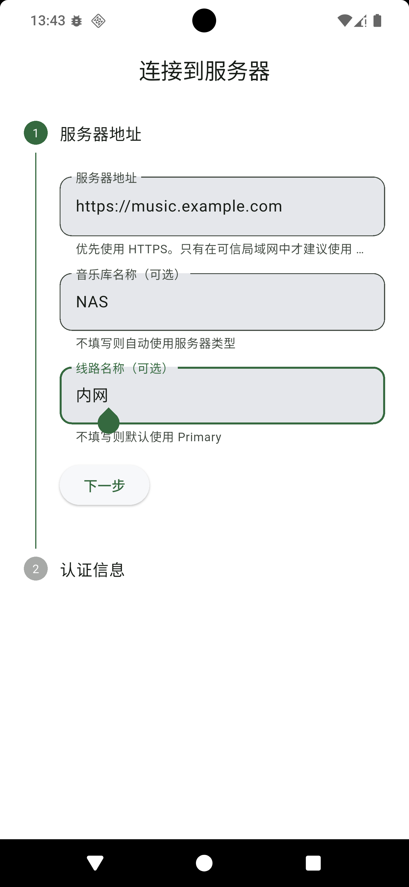
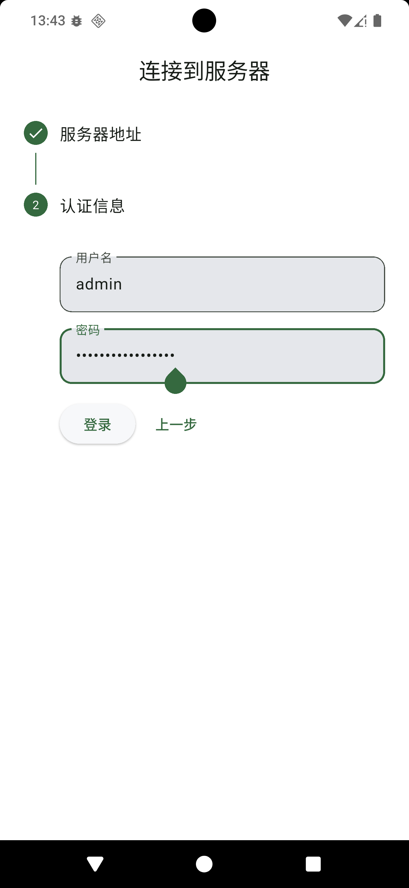

# 快速上手

## 目的

本文说明如何在 Echoes 中配置并登录第一条 Navidrome 线路。

如需先完成服务端部署，请参阅：

- [Navidrome 推荐配置](navidrome-recommended-config.md)
- [Embed 部署教程](embed-deploy.md)

## 前置条件

首次登录前，应准备以下信息：

1. 可访问的 Navidrome 地址
2. 有效的 Navidrome 用户名
3. 对应用户的密码或 API Key

服务器地址应为完整 URL，例如：

- `https://music.example.com`
- `http://192.168.1.10:4533`

建议优先使用 HTTPS。

## 配置第一条线路

Echoes 首次启动后会进入登录向导。第一步为服务器地址配置，建议按下表填写：

| 字段 | 说明 | 示例 |
| --- | --- | --- |
| 服务器地址 | Navidrome 地址，必须包含协议头 | `http://192.168.1.10:4533` |
| 音乐库名称 | 本地显示名称，可选 | `家庭 NAS` |
| 线路名称 | 当前地址的标识名称，可选 | `主线路` |



完成后选择“下一步”。客户端会先检测服务器能力，再进入认证步骤。

## 认证配置

认证页字段如下：

| 字段 | 说明 |
| --- | --- |
| 用户名 | Navidrome 用户名 |
| API Key | 服务器支持时可优先使用 |
| 密码 | 未使用 API Key 时填写 |

建议优先使用 API Key。若仅使用 API Key，密码可留空。



完成填写后选择“登录”。

## 登录后验证

首次登录完成后，建议验证以下事项：

1. 首页数据可正常加载
2. 任意歌曲可正常播放
3. 侧边栏中可看到当前线路名称

上述三项均正常时，可认为第一条线路配置完成。

## 新增后续线路

建议在第一条线路可稳定使用后，再配置附加线路。操作路径如下：

1. 打开侧边栏
2. 展开音乐库列表
3. 进入“编辑音乐库”
4. 添加新地址

建议为线路使用明确名称，例如：

- `主线路`
- `家里`
- `公网`
- `Tailscale`

## 常见配置错误

### 地址缺少协议头

错误示例：

```text
192.168.1.10:4533
```

正确示例：

```text
http://192.168.1.10:4533
```

### 将 Embed Service 地址误填为 Navidrome 地址

Echoes 登录使用的地址必须是 Navidrome 地址，不应填写 Embed Service 地址。

### 端口配置错误

常见默认端口如下：

- Navidrome：`4533`
- Embed Service：`5434` 或 `8080`

### 将 HTTP 风险提示误判为登录失败

当服务器地址使用 HTTP 时，客户端会给出安全提示。该提示用于风险确认，不代表连接失败。
